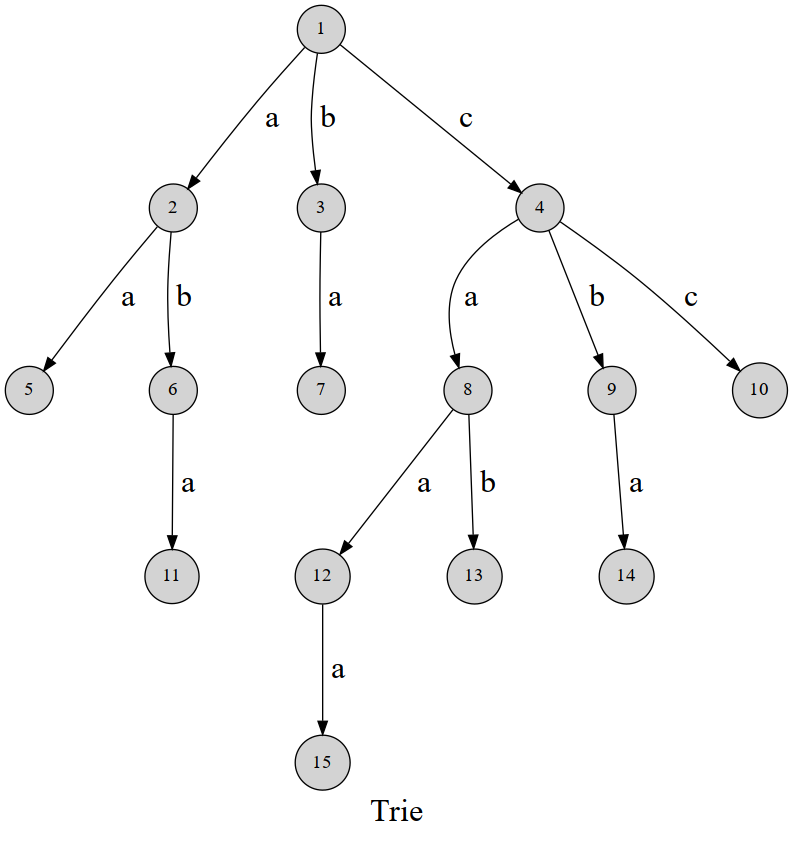

# 字典树 Trie

> [OI Wiki - 字典树 (Trie)](https://oi-wiki.org/string/trie/)  

字典树主要解决两个问题：高效存储字符串、高效查找字符串

字典树的核心在于，字符存储在树的边上，而不是节点上。节点本身存储的是以该节点结尾的字符串数量



这是一份支持大小写字母和数字的字典树模板，字符总数为 26 + 26 + 10 = 62，因此 son 数组的第二维大小为 63（0-62 共 63 个位置）。getid 函数将字符映射到对应的索引，insert 函数用于插入字符串，find 函数用于查找字符串出现的次数

```C++
int son[N][63], cnt[N], idx = 0;
inline int getid(char c) {
  if (c >= 'A' && c <= 'Z') 
    return c - 'A'; // 0-25
  if (c >= 'a' && c <= 'z')
    return c - 'a' + 26; // 26-51
  return c - '0' + 52; // 52-62
}
void insert(string &s) {
  int p = 0, id;
  for (int c : s) {
    id = getid(c);
    if (!son[p][id])
      son[p][id] = ++idx;
    p = son[p][id];
  }
  cnt[p]++;
}
int find(string &s) {
  int p = 0, id;
  for (int c : s) {
    id = getid(c);
    if (!son[p][id])
      return 0;
    p = son[p][id];
  }
  return cnt[p];
}
```

## 01-Trie

01-Trie 是一种特殊的字典树，字符之有两种，最经典的用途有如下几种

### 异或值最大问题

给定一个整数数组，求数组中任意两个数的异或值的最大值

将所有数**从高到低**插入到 01-Trie 中，查询时从高位开始比较，如果当前位为 0，则优先选择 1；如果当前位为 1，则优先选择 0。这种贪心策略保证第一个 1 永远在最高位上，从而得到最大的异或值

对于每个数都要查询一次，因此时间复杂度为 O(n log M)，其中 n 是数组的长度，M 是数的最大值（通常 log M 等于 int 长度）

