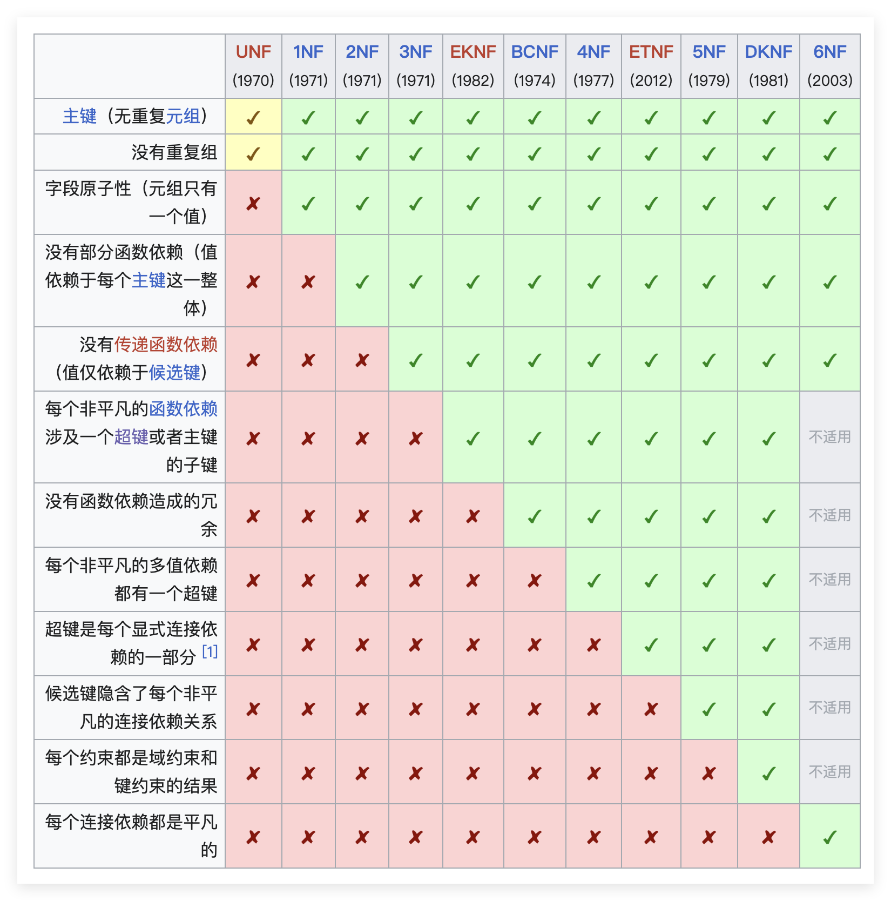

# 关系数据理论

涵盖如下内容

- **数据依赖**：这是理论的基础，主要研究属性间的相互制约关系，包括函数依赖（FD）、多值依赖（MVD）和连接依赖（JD）。
- **范式（Normal Forms）**：通过规范化过程将关系模式划分为不同等级，常见的包括1NF、2NF、3NF、BCNF、4NF 和 5NF，甚至在时态数据库中涉及 6NF。
- **Armstrong 公理系统**：一套用于推理函数依赖闭包、属性闭包及确定关系码的逻辑规则，包含自反律、增广律和传递律。
- **模式分解准则**：研究如何将模式分解为更小的部分，并要求分解满足无损连接性（连接后不丢失信息）和保持函数依赖性。

## 数据依赖

假设有一个关系模式 $R(U)$，$X$ 和 $Y$ 是属性集 $U$ 的子集，如果对于关系 $r(R)$ 中的任意两个元组 $t_1$ 和 $t_2$，当 $t_1[X] = t_2[X]$ 时必然有 $t_1[Y] = t_2[Y]$，则称 $Y$ 函数依赖于 $X$，记作 $X \to Y$

依赖有如下几种类型

### 平凡依赖

如果 $Y \subseteq X$，则称 $X \to Y$ 是平凡依赖

### 非平凡依赖

如果 $Y \not\subseteq X$，则称 $X \to Y$ 是非平凡依赖

### 完全函数依赖 Full Functional Dependency

如果 $X \to Y$ 是非平凡依赖，并且对于 $X$ 的任何真子集 $Z$，$Z \not\to Y$，则称 $Y$ 完全函数依赖于 $X$，记为 $X \xrightarrow{f} Y$

也就是说，只有 $X$ 的全部属性才能决定 $Y$，少一个都不行

### 部分函数依赖 Partial Functional Dependency

如果 $X \to Y$ 是非平凡依赖，并且对于 $X$ 的某个真子集 $Z$，$Z \to Y$，则称 $Y$ 部分函数依赖于 $X$，记为 $X \xrightarrow{p} Y$

也就是说，$X$ 的某个子集就能决定 $Y$，不需要全部属性

### 传递函数依赖 Transitive Functional Dependency

如果 $X \to Y$ 是非平凡依赖，并且存在属性集 $Z$，使得 $X \to Z$ 和 $Z \to Y$ 都是非平凡依赖，则称 $Y$ 传递函数依赖于 $X$，记为 $X \xrightarrow{t} Y$

也就是说，$X$ 通过 $Z$ 间接决定 $Y$，而且两两之间都是非平凡依赖

## 键和属性的概念

在关系模式中已经论述过，这里仅总结一下相关概念

- **候选键**是关系模式中一个或多个属性的**集合**，能够唯一标识关系中的每一个元组，并且满足最小性，即没有任何真子集能够唯一标识元组

- **主键**是从候选键中选定的一个，作为关系的主要标识符

- **主属性**是属于某个候选键的属性

- **非主属性**是不属于任何候选键的属性

- **外键**是一个关系中的属性或属性集合，它在另一个关系中是候选键，用于建立两个关系之间的联系

- **超键**是一个属性或属性集合，它能够唯一标识关系中的每一个元组，但不要求满足最小性，即它可能包含冗余属性
  
## 范式 Normal forms

[数据库规范化](https://zh.wikipedia.org/zh-cn/%E6%95%B0%E6%8D%AE%E5%BA%93%E8%A7%84%E8%8C%83%E5%8C%96) 是一种减少数据库中数据冗余，增进数据的一致性和完整性的设计方法，范式就是规范化的等级划分

可以看见，高等级的范式包含低等级范式的所有要求，并且增加了新的约束条件，下面逐一介绍每个范式以及它们新增的约束条件

### UNF 无范式

UNF 是指未规范化的形式，它不满足任何范式的要求，可能满足有主键且没有重复组的要求，即没有主键相同的行

### 1NF 第一范式

1NF 要求**字段原子性**，即每个属性是不可再分的基本数据项

比如，学生健康状况这个属性，如果它包含了多个健康指标（如血压、心率等），就不满足第一范式，因为它不是原子值

### 2NF 第二范式

2NF 要求**没有部分函数依赖**，即每个非主属性不允许部分依赖于主键

比如，如果有一个选课表，主键是（学号，课程号），如果有一个属性是学生姓名，那么它就部分依赖于主键，因为它只依赖于学号，而不依赖于课程号，这样就不满足第二范式

### 3NF 第三范式

3NF 要求**没有部分传递函数依赖**，即不允许出现 主键 $\to$ 非主属性 $\to$ 非主属性 的依赖关系

比如，如果有一个员工表，主键是员工ID，如果有一个属性是部门ID，另一个属性是部门名称，那么部门名称就传递依赖于员工ID，因为员工ID决定了部门ID，而部门ID又决定了部门名称，这样就不满足第三范式

### BCNF Boyce-Codd 范式

BCNF 要求**每个非平凡的函数依赖涉及一个超键**，即对于每个非平凡函数依赖 $X \to Y$，$X$ 必须是一个超键

通俗来说，如果某些属性（X）能决定另一些属性（Y）
那么 X 必须强到足以唯一标识一行数据（也就是超键）

EKNF 是介于 3NF 和 BCNF 之间的范式，它在 BCNF 的基础上，增加了一条，如果非平凡函数依赖不涉及超键，那么必须涉及主键的子键（即主属性）

通俗来说，如果某些属性（X）能决定另一些属性（Y），要么 X 是超键，要么 Y 的每一个属性都是主属性

比如，如果有一个学生表，主键是学号，如果有一个属性是课程号，另一个属性是教师ID，那么教师ID就依赖于课程号，但课程号不是超键，因为它不能唯一标识一行数据，这样就不满足 BCNF，但满足 EKNF，因为教师ID 是主属性

### 4NF 第四范式

4NF 要求**没有多值依赖**，即对于每个非平凡多值依赖 $X \twoheadrightarrow Y$，$X$ 必须是一个超键

多值依赖的意思就是，在一个表里，给定一个 $X$ 的值，决定了一组 $Y$ 的值，而这组 $Y$ 的值**独立于表中的其他属性**，记为 $X \twoheadrightarrow Y$，非平凡多值依赖的意思是 $Y$ 不是 $X$ 的子集，并且 $X$ 和 $Y$ 没有公共属性，换句话说一定存在非空的 $Z$，使得 $X \cup Y \cup Z = U$，且 $Y$ 和 $Z$ 之间没有任何关系

比如，如果有一个学生表，主键是学号，如果有一个属性是课程号，另一个属性是兴趣爱好，那么课程号和兴趣爱好之间就存在多值依赖，因为给定一个学号，可以有多门课程和多种兴趣爱好，并且课程号和兴趣爱好之间没有任何关系，这样就不满足第四范式

多值依赖和函数依赖的区别

- 在 $X \to Y$（普通函数依赖）中，一个 $X$ 对应唯一一个 $Y$，决定了一行
- 在 $X \twoheadrightarrow Y$（多值依赖）中，一个 $X$ 对应的是一个集合，决定了一组行

### 5NF 第五范式及以上

5NF 要求**没有连接依赖**，即对于每个非平凡连接依赖 $X \Join Y$，$X$ 或 $Y$ 必须是一个超键

6NF 要求**没有时态依赖**，即对于每个非平凡时态依赖 $X \xrightarrow{t} Y$，$X$ 必须是一个超键

### 总结

最重要的五个范式

|范式|关键约束条件|
|---|---|
|1NF|字段原子性|
|2NF|没有部分函数依赖|
|3NF|没有部分传递函数依赖|
|BCNF|每个非平凡函数依赖涉及一个超键|
|4NF|没有多值依赖|

关系规范化不能盲目追求高范式

|范式|优势|劣势|
|---|---|---|
|高范式|减少数据冗余，提高数据一致性和完整性|可能导致过多的表分解，增加查询复杂度和性能开销|
|低范式|查询效率较高，减少连接操作|可能存在数据冗余，增加数据不一致的风险|

多数情况下，**满足 3NF/BCNF 即可**，再根据实际情况调整——如果写入是瓶颈，那么提高范式；如果查询是瓶颈，那么降低范式

## 函数依赖公理系统

### 逻辑蕴含

如果一个函数依赖 $X \to Y$ 可以通过一系列函数依赖 $F$ 的推理得到，那么称 $X \to Y$ 逻辑蕴含于 $F$，记为 $F \models X \to Y$

比如，只要 $F$ 中的“学号定班级”和“班级定老师”是真的，那么“学号定老师”就一定是真的，即 $F \models$ 学号 $\to$ 老师

### 闭包和闭包求解

函数依赖的闭包 $F^+$ 是指所有可以通过 $F$ 推理得到的函数依赖的集合

属性集 $X$ 在 $F$ 下的闭包 $X^+$ 是指在函数依赖集合 $F$ 的约束下，$X$ 可以决定的所有属性的集合

求解 $X^+$ 的算法步骤如下

1. 初始化 $X^+ = X$
2. 对于 $F$ 中的每个函数依赖 $Y \to Z$，如果 $Y \subseteq X^+$，则将 $Z$ 加入 $X^+$ 中
3. 重复步骤 2，直到 $X^+$ 不再发生变化

### Armstrong 公理系统

阿姆斯特朗公理系统是一套用于推理函数依赖的逻辑规则，包含以下三条基本公理：

- 自反律（Reflexivity）：如果 $Y \subseteq X$，则 $X \to Y$ 成立
- 增广律（Augmentation）：如果 $X \to Y$，则对于任何属性集 $Z$，$XZ \to YZ$ 也成立
- 传递律（Transitivity）：如果 $X \to Y$ 且 $Y \to Z$，则 $X \to Z$ 成立

此外，还有一些推论可以从基本公理中得出：

- 联合律（Union）：如果 $X \to Y$ 和 $X \to Z$，则 $X \to YZ$ 成立
- 分解律（Decomposition）：如果 $X \to YZ$，则 $X \to Y$ 和 $X \to Z$ 都成立
- 伪传递律（Pseudotransitivity）：如果 $X \to Y$ 和 $WY \to Z$，则 $WX \to Z$ 成立
- 复合律（Composition）：如果 $X \to Y$ 和 $W \to Z$，则 $XW \to YZ$ 成立

此公理有以下性质：

- **完备性**：任何 $F^+$ 中的函数依赖都可以通过 Armstrong 公理系统和 $F$ 推导出来
- **有效性**：通过 Armstrong 公理系统和 $F$ 推导出的任何函数依赖都必然属于 $F^+$

总结一下

|公理|内容|通俗描述|
|---|---|---|
|自反律|$Y \subseteq X \Rightarrow X \to Y$|属性可以推出子集|
|增广律|$X \to Y \Rightarrow XZ \to YZ$|依赖左右两边同时加上属性集|
|传递律|$X \to Y \land Y \to Z \Rightarrow X \to Z$|传递依赖|
|联合律&分解律|$X \to Y \land X \to Z \Leftrightarrow X \to YZ$|联合与分解|
|伪传递律|$X \to Y \land WY \to Z \Rightarrow WX \to Z$|伪传递依赖|
|复合律|$X \to Y \land W \to Z \Rightarrow XW \to YZ$|合并两个依赖|

### 函数依赖的等价和覆盖

如果两个函数依赖集 $F$ 和 $G$ 满足 $F^+ = G^+$，则称 $F$ 和 $G$ 是等价的，记为 $F \equiv G$

如果 $F$ 和 $G$ 满足 $F^+ \subseteq G^+$，则称 $G$ 覆盖 $F$，记为 $F \preceq G$

判断 $F$ 和 $G$ 是否等价的步骤如下:

1. 对于 $F$ 中的每个函数依赖 $X \to Y$，检查 $Y$ 是否包含在 $X^+$ 在 $G$ 下的闭包，如果是则 $F \preceq G$
2. 对于 $G$ 中的每个函数依赖 $X \to Y$，检查 $Y$ 是否包含在 $X^+$ 在 $F$ 下的闭包，如果是则 $G \preceq F$
3. 如果 $F \preceq G$ 且 $G \preceq F$，则 $F \equiv G$

### 最小函数依赖集

一个函数依赖集 $F$ 是最小的，如果满足以下三个条件：

1. 原子性：每个函数依赖 $X \to Y$ 中，$Y$ 是单属性
2. 无冗余：对于 $F$ 中的每个函数依赖 $X \to Y$，如果从 $F$ 中去掉它，那么 $F$ 的闭包 $F^+$ 就会发生改变
3. 无冗余属性：对于 $F$ 中的每个函数依赖 $X \to Y$，如果从 $X$ 中去掉一个属性，那么 $F$ 的闭包 $F^+$ 就会发生改变

求最小函数依赖集的步骤就是依次满足上述三个条件，直到无法再满足为止，具体算法如下

1. **原子化**：对于 $F$ 中的每个函数依赖 $X \to Y$，如果 $Y$ 包含多个属性，则将其分解为多个单属性的函数依赖
2. **左部去重**：对于 $F$ 中的每个函数依赖 $X \to Y$，检查 $X$ 中的每个属性是否冗余，如果是则从 $X$ 中去掉它
3. **依赖去重**：对于 $F$ 中的每个函数依赖 $X \to Y$，检查它是否冗余，如果是则从 $F$ 中去掉它

依赖去重的具体步骤：对于每一个依赖 $X \to Y$，先将它从 $F$ 中去掉，得到一个新的函数依赖集 $F' = F - \{X \to Y\}$，然后求 $F'$ 的闭包 $F'^+$，如果 $X \to Y$ 仍然在 $F'^+$ 中，那么说明它是冗余的，否则说明它不是冗余的

求出的结果记为 $F_{min}$