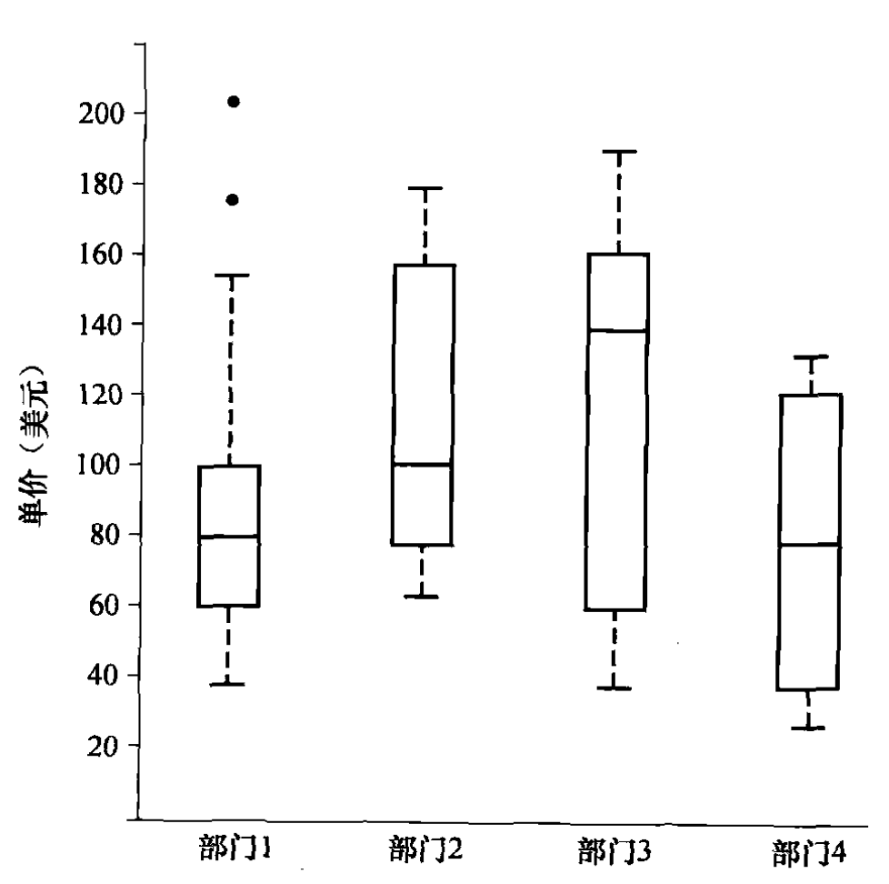

# 数据

## 属性

首先，这几个概念都是一个意思

- 属性 attribute（数据挖掘）
- 特征 feature（机器学习）
- 维度 dimension（数据仓库）
- 变量 variable（统计学）
- 列 column（数据库）

按照值的性质，属性有这些类

- 标称属性 nominal attribute：没有顺序关系。比如性别、颜色、城市等
- 二元属性 binary attribute：只有两个取值。比如是/否、有/无等
- 序数属性 ordinal attribute：有顺序关系。比如教育程度、满意度等
- 数值属性 numerical attribute：取值是数值的。比如身高、体重、年龄等

> 二元属性一般用1表示稀有值\
> 序数属性和二元属性都使用数字表示了某种含义，而数值属性的数字本身就是含义

按照离散性，还能分类为

- 离散属性 discrete attribute：取值是离散的。比如性别、颜色、城市等
- 连续属性 continuous attribute：取值是连续的。比如身高、体重

## 统计

### 中心趋势度量

- 均值 mean
  - 算数平均 arithmetic mean
  - 加权平均 weighted mean
  - 截尾平均 trimmed mean，去掉最大和最小的若干个值后求平均
- 中位数 median
- 众数 mode
- 中列数 midrange，最大值和最小值的平均数

> 注意单位，比如 $1,000, 1M人

按照 mode 的数量分布

- 单峰 unimodal
- 双峰 bimodal
- 三峰 trimodal
- 多峰 multimodal，mode 的数量大于 2 即可

按照数据对称性分类：

- 正倾斜 postive skewed，绝大多数数值较小，Mean > Median > Mode
- 负倾斜 negative skewed，绝大多数数值较大，Mean < Median < Mode

### 数据散步度量

- 分位数 quantile
  - 四分位数 quartile，也用 Q1, Q2, Q3 表示
  - 百分位数 percentile
- 极差 range，最大值和最小值的差
  - 四分位数极差 IQR，Q3 - Q1
- 方差 variance
- 标准差 standard deviation

分位数就是能将数据刨掉多少的值，比如 Q1 就是将数据刨掉 25% 的值，但具体定义有多种，最基础的定义是

$$
L=\frac{P}{100} \times n
$$

$$
Q_P=
\begin{cases}
x_{\lceil L\rceil},&L\notin\mathbb{Z}\\[6pt]
(x_L+x_{L+1})/2,&L\in\mathbb{Z}
\end{cases}
$$

此外还有 n+1 差值和 n-1 差值的定义

这里的方差和标准差指的是总体方差和总体标准差，计算公式如下

$$
s^2=\frac{\sum_{i=1}^{n}(x_i-\bar{x})^2}{n}
$$

$$
s=\sqrt{s^2}
$$

### 描述图形

- 直方图 histogram
- 频率分布直方图
- 箱线图 boxplot
- 散点图
- 分位数图

boxplot 如下

- 盒的三条线分别是 Q1, Q2, Q3，盒的高度是 IQR
- 盒子外的线是胡须，标注非异常值的最值
- 胡须外的是异常值，异常值是指离 Q1 或 Q3 1.5 倍 IQR 之外的值，异常值用圆点表示

## 数据可视化

## 相似性和相异性

### 数据矩阵和相异性矩阵

这是 n 个对象的 p 个属性的数据矩阵

$$
\begin{bmatrix}
x_{11} & \cdots & x_{1j} & \cdots & x_{1p} \\
\vdots & \ddots & \vdots &        & \vdots \\
x_{i1} & \cdots & x_{ij} & \cdots & x_{ip} \\
\vdots &        & \vdots & \ddots & \vdots \\
x_{n1} & \cdots & x_{nj} & \cdots & x_{np}
\end{bmatrix}
$$

这是 n 个对象的相异性矩阵

$$
\begin{bmatrix}
0 &        &        &        &   \\
d(2,1) & 0      &        &        &   \\
d(3,1) & d(3,2) & 0      &        &   \\
\vdots & \vdots & \vdots & \ddots &   \\
d(n,1) & d(n,2) & \cdots & \cdots & 0
\end{bmatrix}
$$

### 临近性度量

临近性一般是相似性 similarity 和相异性 dissimilarity 的度量，二者是互补的

相似性等于1减去相异性

$$
\text{sim}(i,j)=1-d(i,j)
$$

#### 标称属性

对于颜色、性别等标称属性，最常用的相异性度量是简单匹配系数 simple matching coefficient

$$
d(i,j)=\frac{p-q}{p}
$$

其中，$p$ 是属性的总数，$q$ 是对象之间不同属性的数量

#### 二元属性

对于 0/1 的二元属性，有三种度量

对于对称二元相异性：

$$
d(i,j)=
\frac{
A_{i=1,j=0}+A_{i=0,j=1}
}{
A_{i=1,j=1}+A_{i=1,j=0}+A_{i=0,j=1}+A_{i=0,j=0}
}
$$

对于非对称二元相异性，也就是 1 表示稀有值的情况：

$$
d(i,j)=
\frac{
A_{i=1,j=0}+A_{i=0,j=1}
}{
A_{i=1,j=1}+A_{i=1,j=0}+A_{i=0,j=1}
}
$$

用1减去上述公式就是 Jaccard 相似系数

$$
\operatorname{sim}(i,j)=1-d(i,j)=
\frac{
A_{i=1,j=1}
}{
A_{i=1,j=1}+A_{i=1,j=0}+A_{i=0,j=1}
}

$$

#### 数值属性

欧几里得距离 Euclidean distance

$$
d(i,j)=\sqrt{\sum_{k=1}^{p}(x_{ik}-x_{jk})^2}
$$

曼哈顿距离 Manhattan distance

$$
d(i,j)=\sum_{k=1}^{p}|x_{ik}-x_{jk}|
$$

闵可夫斯基距离 Minkowski distance，也称 $L_r$ norm

$$
d(i,j)=\left(\sum_{k=1}^{p}|x_{ik}-x_{jk}|^r\right)^{1/r}=L_r
$$

切比雪夫距离 Chebyshev distance

$$
d(i,j)=\max_{k=1}^{p}|x_{ik}-x_{jk}|
$$

#### 序数属性

排名，归一化到 [0,1]，再用任意数值属性的距离度量方法计算即可，公式如下：

$$
x_{norm} = \frac{x - x_{min}}{x_{max} - x_{min}}
$$

例如：

S、M、L、XL、XXL 可以排名为 1、2、3、4、5，归一化后为 0、0.25、0.5、0.75、1

#### 混合属性

$$
d(i,j)
=
\frac{
\sum_{f=1}^{p}\delta_{ij}^{(f)}d_{ij}^{(f)}
}{
\sum_{f=1}^{p}\delta_{ij}^{(f)}
}
=
\frac{\text{所有有效属性的距离加起来}}
{\text{有效属性个数}}
$$

其中，$f$ 就是属性，$\delta_{ij}^{(f)}$ 就是一个“这个属性要不要参与计算”的布尔值，$d_{ij}^{(f)}$ 是一个 [0, 1] 区间内的数值，归一化方法如下：

- 数值属性：将所有 d(i, j) 除以该属性的最大值和最小值的差
- 标称属性和二元属性：相同为 0，不同为 1
- 序数属性：使用上一节的方法自然归一到 [0, 1] 区间

#### 向量属性

余弦相似性 cosine similarity，即向量夹角余弦值，越接近1越相似

$$
\cos(i, j)=\frac{d_i\cdot d_j}{||d_i||\times||d_j||}=\frac{\sum_{k=1}^{p}x_{ik}\times x_{jk}}{\sqrt{\sum_{k=1}^{p}x_{ik}^2}\times\sqrt{\sum_{k=1}^{p}x_{jk}^2}}
$$