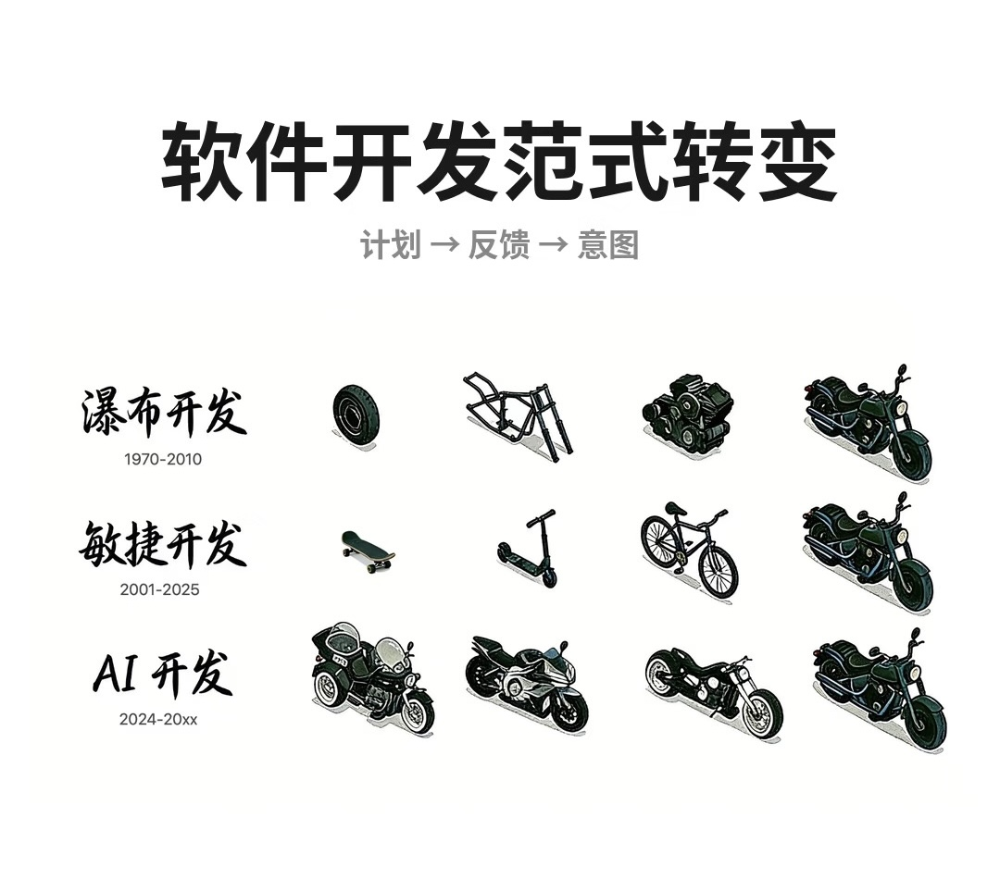

# 现代软件工程导论

## 内容概述

这门课包括多个领域的内容，包括

- 软件架构与模式
  - 微服务与分布式系统
  - 设计模式
  - 容器化
- 现代开发方法论
  - 开发范式
  - 持续集成与持续交付（CI/CD）
  - DevOps
- 工程化工具链
  - 版本控制系统（如 Git）
  - 构建和部署工具（如 Gradle）
  - 自动化测试工具
- 前沿技术
  - 云原生开发
  - 函数式编程 / 反应式编程
  - LLMOps（如 RAG / MCP）
  - AgentOps

### DevOps

概念诞生于 2009 年，即 Development 和 Operations 的结合，短短几年间，DevOps 经历了如下演进

- DevOps：原始概念，强调开发和运维的协作沟通
- MLOps：DevOps + 数据版本控制 + 模型监控，需要考虑数据和模型的版本管理、监控和自动化部署等方面
- LLMOps：MLOps + Prompt 管理 + RAG + 成本优化
- AgentOps：LLMOps + 思考链 + 任务调度

### 开发范式

- 瀑布开发：Linear development，强调阶段性的开发流程，适用于需求明确、变化较少的项目
- 敏捷开发：Agile development，强调迭代和增量开发，适用于需求不确定、变化频繁的项目

简单来说，可以用下面这种图总结

- 瀑布开发：一个一个阶段完成，最后交付整个系统
- 敏捷开发：先把基础功能实现，再不断迭代升级
- AI 开发：直接做出整个系统，再不断迭代优化