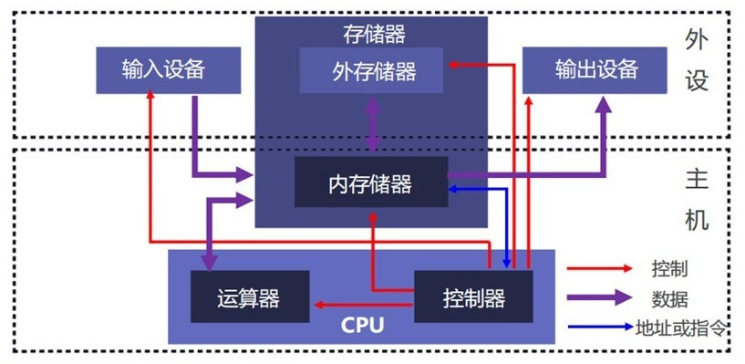
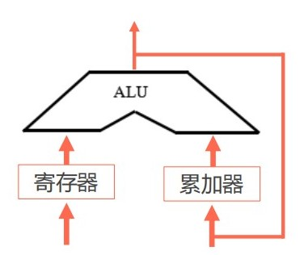
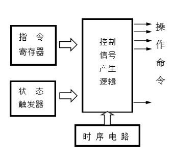
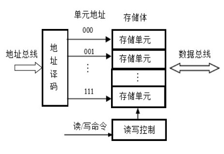

# 计算机系统概述

## 计算机发展历程

- 古代计算工具
- 机械式计算机
- 机电式计算机：如 Harvard Mark I，靠继电器工作
- 真空管计算机：如 ENIAC，世界上第一台通用电子计算机，现代计算机的开端
- 晶体管计算机
- 集成电路计算机
- 大规模集成电路计算机

> 虽然阿塔纳索夫-贝瑞计算机 ABC 和破解恩尼格玛的“巨人” Colossus 计算机都是电子计算机且出现时间比 ENIAC 更早，但是他们都是专用型的

计算机发展的规律

- Moore's Law 摩尔定律：价格不变时时，集成电路可容纳晶体管数目每 18-24 个月便会翻一番，但近年放缓
- Bell's Law 贝尔定律：大约每隔 10 年，会诞生一代新型计算机
- Gilder's Law 吉尔德定律：主干网带宽增长速度远快于算力的增长速度
- Metcalfe's Law 梅特卡夫定律：网络的价值与联网的用户数 Nodes 的平方成正比
- DRAM发展：DRAM 密度每年增长 60%
- 硬盘发展：硬盘密度每年增长一倍

## 冯诺依曼计算机

### 硬件结构

运算器负责算术运算和逻辑运算，由算术逻辑单元 ALU 和寄存器（如累加器 AC）组成

控制器负责协调系统中所有部件的工作，由程序计数器 PC、指令寄存器 IR、指令译码器 ID 和微操作控制单元 CU组成，控制“取指-译码-执行”的循环过程

存储器负责存放程序指令和数据，通过内存地址寄存器 MAR 接收地址，并通过内存数据寄存器 MDR/MBR 交换数据

|运算器结构|控制器结构|存储器结构|
|---|---|---|
||||

- 早期描述中常强调运算器为中心，现代实现更强调存储层次与总线互联
- 指令由操作码和地址码组成，这是冯诺伊曼机的语言核心
- 上述所有结构均为原始的冯诺伊曼结构，现代计算机可能有所不同

### 软件结构

分为：

- 应用软件：解决某个领域问题的程序
- 系统软件：负责管理计算机硬件资源、并为应用软件提供运行环境与基础服务的核心程序

> 除了操作系统，DBMS、语言处理程序（如编译器）、驱动程序、服务程序（如诊断程序）也是系统软件

## 计算机系统层次结构

从上至下：

- 应用程序
- 高级语言
- 汇编语言
- 操作系统
- 指令集架构 ISA
- 微代码层
- 硬件逻辑层 / 数字逻辑层

其中操作系统及上方是软件部分，ISA 是软硬件交界面

## 计算机系统性能评价

首先区别

- 位 bit
- 字节 Byte = 8 bit
- 字：Word，特定机器字长中的一组位
- 机器字长 Word Length：固定数值，通常为64位

源自希腊语的大单位

- Kilo / K = $10^{3}$ = 千
- Mega / M = $10^{6}$ = 百万
- Giga / G = $10^{9}$ = 十亿
- Tera / T = $10^{12}$ = 万亿
- Peta / P = $10^{15}$ = 千万亿
- Exa / E = $10^{18}$ = 百亿亿

### 非时间指标

机器字长：运算器 ALU 和通用寄存器的位数

#### 主存 / 内存

容量，单位GB
带宽，单位B/s

#### CPU 主频与时钟周期

- 外频：主板的工作频率，通常为 100 MHz
- 倍频：486后出现的技术，使得CPU频率高于外设
- 主频 f = 外频 $\times$ 倍频，就是 CPU 工作频率
- 时钟周期 T = 1 / f，CPU 一个时钟周期花费的时间

> 奔腾时代的计算机北桥频率就是外频，北桥负责作 PCIe 控制器和和内存控制器，现代计算机将北桥的功能集成进了 CPU，物理意义上外频已经消失了，现在常用外频指基准时钟频率 BLCK，在现代计算机上
> $$
> \begin{cases}
> \text{CPU}主频 = \text{BLCK} \times \text{CPU}倍频 \\
> 内存频率 = \text{BLCK} \times \text内存倍率 \\
> 总线频率 = \text{BLCK} \times \text总线倍率
> \end{cases}
> $$

#### CPI / IPC / MIPS

- CPI 即指令所花费的时钟周期的加权平均
- IPC = 1 / CPI，即一个时钟周期可以执行的指令数量
- CPU执行时间 = 指令数量 $\times$ CPI $\times$ T

> RISC 的目标 CPI 是 1.0，指令固定长度且简单，CISC 指令更少但功能更强，CPI 通常大于 1

- MIPS 每秒钟执行指令**百万**条数，下面是一个重要公式

$$
\begin{align}
\text{MIPS} &= \frac{指令数量}{\text{CPU执行时间} \times 10^{-6}} \\
&= \frac{指令数量}{指令数量 \times \text{CPI} \times \text{T} \times 10^{-6}} \\
&= \frac{f}{\text{CPI}} \\
&= IPC \times f
\end{align}
$$

注意 f 的单位是 MHz

#### FLOPS

TFLOPS 即每秒多少万亿次浮点运算，它是纯粹的数学产出指标

> MIPS 在 80-90 时代非常流行，但后来被戏称为 “Meaningless Indicator of Processor Speed”，因为不同架构的指令效率差太多，光看指令数没意义

除此以外还有 GFLOPS、PFLOPS 分别用于更慢或更快的计算机芯片

> 由于计算精度不同，FLOPS 通常有多个数值，常见的有高精度 FP64、单精度 FP32、半精度 FP16。此外还有整数的指标 OPS 和精度 INT8，常用于 AI 推理。
>
> 从 2015 年的 GTX 980 Ti 到 2025 年的 RTX 5090，TFLOPS (FP32) 从 6.060 增长到了 104.8
