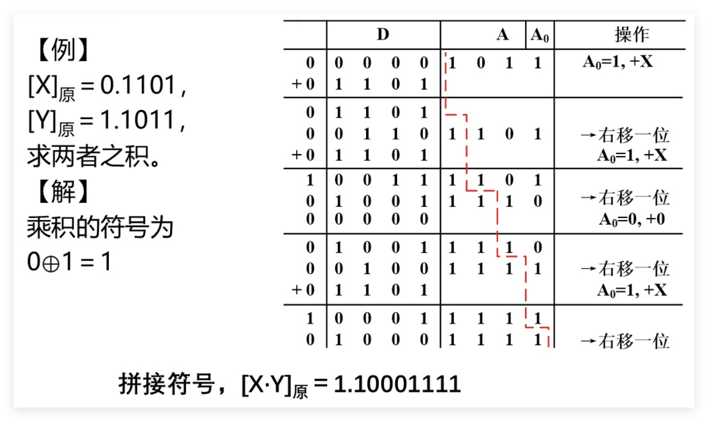
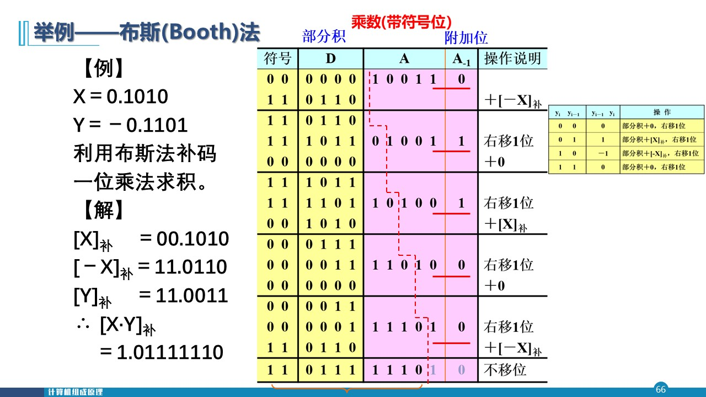
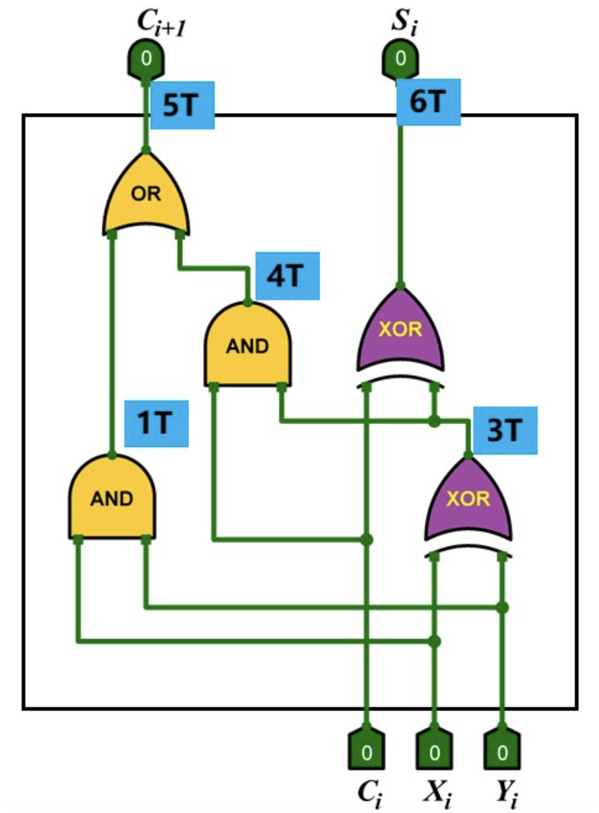
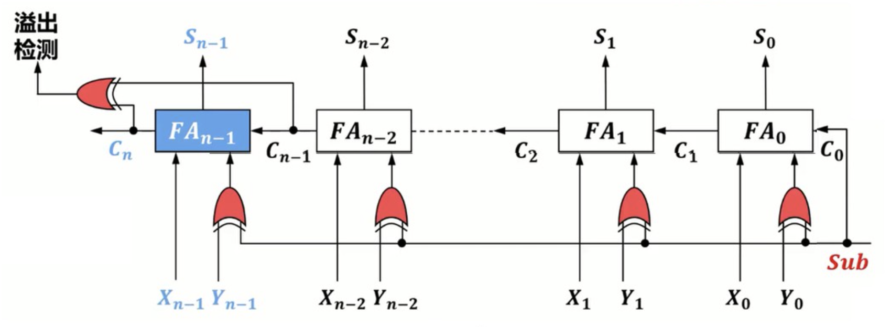
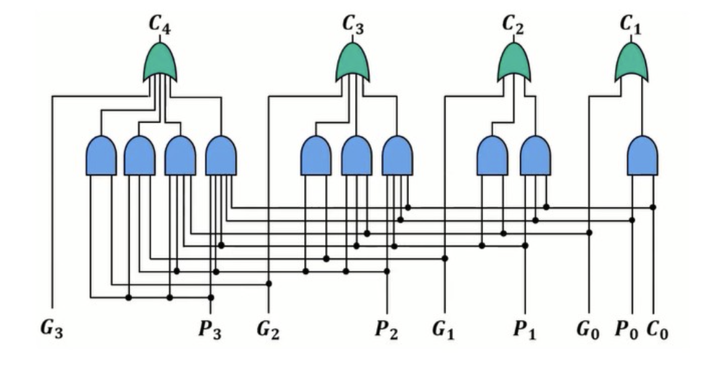
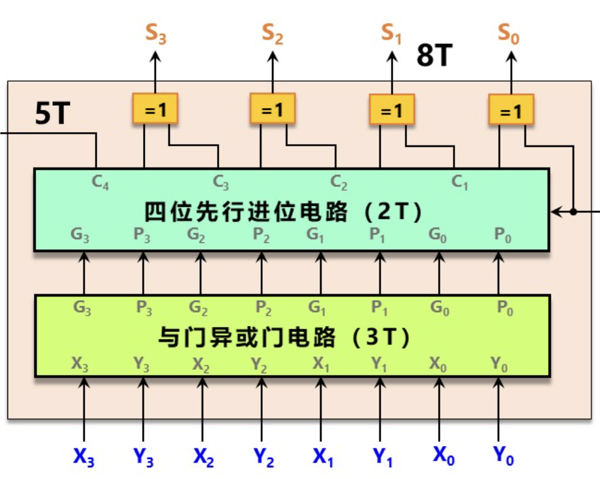

# 数值表示和运算

## 数值分类

- 无符号数
- 有符号数
  - 定点数
    - 整数
    - 纯小数
  - 浮点数
    - 单精度
    - 双精度
  
> IEEE754 规定32位和64位浮点数的符号位、指数位、尾数位分别是 1 8 23 和 1 11 52; 在嵌入式开发中会使用纯小数逻辑，被称为 Q 格式

## 进制转换

十转二，整数模 2 取余，小数乘 2 取整

二转八 / 十六，整数左边补 0，小数右边补 0，转八三个一组，转十六四个一组

> 表示 $17 / 128$ 的方法：
> $$
> \frac{17}{128} = \frac{2^4\times 2^0}{2^7} = 2^{-3} + 2^{-7} = (0.0010001) _2
> $$

常用 2 的幂次

$$

2^3 = 8 \\
2^4 = 16 \\
2^5 = 32 \\
2^6 = 64 \\
2^7 = 128 \\
2^8 = 256 \\
2^9 = 512 \\
2^{10} = 1024 \\
2^{15} = 32768 \\
2^{16} = 65536 \\
2^{31} = 2147483648 \\
2^{63} \approx 9 \times 10^{18}

$$

## 机器码

码值：无论表示方式，将比特链转换为无符号整数

### 真值

真值在书面上用 `+ -` 表示符号位

如：14 表示为 +1110，-0.25 表示为 -0.01，以下数字如无特殊注明，都为二进制真值

### 原码

$$
符号位 + 数值位
$$

符号位为 0 表正，1 表负，数值位即为真值的绝对值，对于整数来说：

$$
[X]_{原} =
\begin{cases}
X, & 0 \le X < 2^{n-1} \\
2^{n-1} - X, & -2^{n-1} < X \le 0
\end{cases}
$$

其中 $n$ 是编码位数。对于小数来说

$$
[X]_{原} =
\begin{cases}
X, & 0 \le X < 1 \\
1-X, & -1 < X \le 0
\end{cases}
$$

如：+1110 可表示为 11110，其码值为 $(30)_{10}$，-0.01 可表示为 1.01

> n 位字长的原码的标识范围为 $(-2^{n-1},2^{n-1})$

原码的缺点是：0 有两种表示且符号位无法直接参与计算

### 补码

补码的意义就在于将减法变加法

如果确定了“模”，就可以找到一个正数等价代替负数，这个整数就是该负数的补数。比如，在 mod 12 意义下，-4 可以表示为 8。一个负数的补数就是模数加上负数本身，一个正数就是它本身。

在这种规则下，可以将数值范围拆成两半分别表示正数和负数，$A-B$ 就能表示为 $[A]_补 + [B]_补$ 这样就完成了将减法变加法

$$
[X]_{补} =
\begin{cases}
X, & 0 \le X < 2^{n-1} \\
2^{n} + X, & -2^{n-1} \le X < 0
\end{cases}
$$

其中 $n$ 为编码位数，$2^n$ 是模数，也是系统容量

为了让电路快速计算上述公式中的负数，于是计算机硬件采用了这种方式：符号位 + 数值位取反加一

### 总结

在机器中 / 二进制下

$$
负数：
X \xrightleftharpoons[符号位变-]{符号变1}
[X]_{原} \xrightleftharpoons[数值位取反]{数值位取反}
[X]_{反} \xrightleftharpoons[-1]{+1}
[X]_{补} \xrightleftharpoons[符号位取反]{符号位取反}
[X]_{移}
$$

$$
正数：
X \xrightleftharpoons[符号位变+]{符号变0}
[X]_{原} \xrightleftharpoons[不变]{不变}
[X]_{反} \xrightleftharpoons[不变]{不变}
[X]_{补} \xrightleftharpoons[符号位取反]{符号位取反}
[X]_{移}
$$

在数学上

$$
\begin{align*}
X = [X]_{原} = [X]_{反} = [X]_{补}, & 0 \le X < 2^{n-1} \\
[X]_{原} = 2^{n-1} - X, & -2^{n-1} < X \le 0 \\
[X]_{反} = 2^n - 1 + X, & -2^{n-1} < X \le 0 \\
[X]_{补} = 2^{n} + X, & -2^{n-1} \le X < 0 \\
[X]_{移} = 2^{n-1} + X, & -2^{n-1} \le X < 2^{n-1} \\
\end{align*}
$$

## 浮点数

### 非标准浮点数

### IEEE 754

在 [Wikipedia IEEE 754](https://zh.wikipedia.org/zh-cn/IEEE_754) 规格化浮点数的标准中，实数 $V$ 可表示为

$$
V = (-1)^S \times M \times 2^E
$$

其中 S 为符号位，M 为阶码，E 为尾数，常见存储格式有如下两种

|格式|总位数|符号位 S|阶码 E|尾数 M|偏移量|
|---|---|---|---|---|---|
|单精度 float|32 bit|1 bit|8 bit|23 bit|-127|
|双精度 double|64 bit|1 bit|11 bit|52 bit|-1023|

符号位中，0 代表正，1代表负

阶码不使用补码而是使用偏移量码，比如在 float 的 8 bit 阶码中，E = 2 就要记为 `01111111 + 00000010 = 10000001'

尾数是一个整数部分隐藏了一个 1 的小数，只记录小数点后的数字，比如 $1.101$ 记为 `101...`

> 偏移量码 Biased Representation 是一种广义上的移码，和上文说的移码 Offset Binary 并不相同

例如十进制数 $6.5$ 存在 float 中：

- 先转换为二进制：$(6.5)_{10} = (110.1)_2$
- 规格化：$(110.1)_2 = (1.101)_2 \times 2^2$ 即 $S=0,M=(1.101)_2,E=2$
- 将阶码加上偏移量：$2 + 127 = 129 = (10000001)_2$
- 拼接：`0` (S) `10000001` (E) `10100000000000000000000` (M)

对于规格化数，以 float 为例

- 最大正数为 $(2 - 2^{-23}) \times 2^{127}$，其中 23 是尾数位数，127 为最大阶码

规格化数下阶码不能全为 1 或全为 0，具体原因如下。所以 8 位阶码可表示的范围是 [-126, 127]

### IEEE 754 +

除了规格化浮点数，还有非规格化的浮点数和几个特殊数值，以 float 为例：

|值类型|符号位|阶码|尾数|值 / 值域|
|---|---|---|---|---|
|正零|0|0|0|$0$|
|负零|1|0|0|$-0$|
|正无穷大|0|全1|0|$\infty$|
|负无穷大|1|全1|0|$-\infty$|
|无定义|0或1|全1|$\ne$ 0|$\text{NaN}$|
|非规格化正数|0|0|$\ne$ 0|$[1\times 2^{-149},1\times 2^{-126})$|
|非规格化负数|1|0|$\ne$ 0|$(-1\times 2^{-126},-1\times 2^{-149}]$|

> NaN 意为 Not a Number

非规格化数是为了解决规格化数隐藏 1 导致过小的数无法接近 0 的问题。当且仅当阶码全为 0 且尾数不为 0 时成立。此时尾数不再隐藏 1，整数部分为 0

1. 最小的规格化正数：阶码码值为 1，尾数全 0。以 float 为例，此时阶码为 -126，尾数为 1.0，即 $1\times10^{-126}$
2. 最小的非规格化正数：上者的阶码再减尾数 bit 数，以 float 为例，$-126-23=-149$，即 $1\times 2^{-149}$
3. 剩余值都可以通过上述二者加减 1 或取相反数获得

## 类型转换

### 浮点数转换

例如 $(3.3)_{10}$ 转 float

- 化为二进制 $11.01001100110011001100110...$
- 规格化：$+1.10100110011001100110011(0...) \times 2^{1}$ 取 23 位
- 求 SME：0 10000000 10100110011001100110011
- 舍入处理：第 24 位为 0，不进位
- 拼接二进制：0 10000000 10100110011001100110011
- 化为十六进制：40533333

> 转为 float 时要遵循 “舍入”，若截断后第一位为 1 则末位加 1，规则类似四舍五入，若导致最高位进位则阶码加一

例如 float 机器码 C1830000（十六进制）转化为为真值

- 先化为二进制：1100 0001 1000 0011...
- 拆成 SME 三部分 1 10000011 1.0000011
- 求 SME：+、4、$(1 + 2^{-6} + 2^{-7})$
- $2^4 * (1 + 2^{-6} + 2^{-7})$
- $16 + 0.25 + 0.125$
- 别忘了符号 $-16.375$

### 整数转换

|转换方向|1B (char)|2B (short)|4B (int)|8B (long long)|
|---|---|---|---|---|
|1B (char)|注意符号|安全 (扩展)|安全 (扩展)|安全 (扩展)|
|2B (short)|截断风险|注意符号|安全 (扩展)|安全 (扩展)|
|4B (int)|截断风险|截断风险|注意符号|安全 (扩展)|
|8B (long long)|截断风险|截断风险|截断风险|注意符号|

> char 是否为 signed 取决于编译器，x86 通常为 signed

## 非数值表示

字符集和字符编码的区别：字符集是一个集合，字符编码是字符集到计算机编码的映射关系，例如：Unicode 是一个字符集，其中 UTF-8 是最常用的编码方式

ANSI 表示本地字符集，在中国大陆通常是 GBK，在港台通常是 Big5，在日本通常是 Shift-JIS，在欧美通常是 ISO-8859-1

### ASCII

ACSII 既是字符集也是编码方式，它收录了 128 个字符，包括英文字母、数字、标点符号和一些控制字符，每个字符用 7 位二进制数表示，范围是 0~127

以下是几个关键位置的编码：

|字符|十六进制|十进制|
|---|---|---|
|A|41H|65|
|a|61H|97|
|0|30H|48|

### Unicode

Unicode 是一个字符集，目标收录全球所有语言的字符和符号

其中 UTF-8 是一种变长编码方式，兼容 ASCII，使用 1~4 个字节表示一个 Unicode 字符，为了扫描时能识别字符长度，UTF-8 规定了每个字节的前几位表示字符长度：

|字节数|前几位|剩余位数|对应字符集|
|---|---|---|---|
|1|0|7|ASCII 字符集|
|2|110|5|带重音符号的拉丁字母、欧洲/中东语系字符|
|3|1110|4|中日韩汉字、其他常用符号与标点|
|4|11110|3|Emoji、古文字、其他罕见字符|

从第 2 字节开始，前面有几个 1 就代表这个字符占几个字节

### GB2312

GB2312 既是字符集也是编码方式，它收录了 6763 个常用汉字和 682 个非汉字图形符号

GB2312 将字符放入一个 94x94 的表格中，行列号分别用 1~94 的数字表示，行（区）和列（位）共同组成区位码，编码时将行列号分别加上 0xA0 就得到了该字符的编码

例如，“啊”的区位码是 16 行 01 列，编码就是 0xA0 + 16 = 0xB0 和 0xA0 + 1 = 0xA1，即 0xB0A1

行列号加上 0xA0 的原因是为了兼容 ASCII，ASCII 字符的编码范围是 0x00~0x7F，而 GB2312 的编码范围是 0xA1~0xFE，这样就不会与 ASCII 冲突

随着汉字需求增加，出现了 GBK 和 GB18030 两个扩展编码，分别收录了 21003 个和 70244 个汉字，都向下兼容 GB2312

## 数据校验

### 码距和校验

码距是任意两个合法编码间不同的二进制位数的最小值

例如在 3 位二进制编码中，000、001、010、011、100、101、110、111 都是合法编码，码距为 1。如果规定只有 000、111 是合法编码，那么码距为 3

校验就是在编码中添加冗余位，使得码距增加，从而能够检测和纠正错误

### 奇偶校验

奇偶校验是最简单的校验方法，在编码中添加一个校验位，使得整个编码中 1 的个数为偶数（偶校验）或奇数（奇校验）

现实中常用偶校验，校验过程就是将全部位（包括校验位）异或，如果结果为 0 则没有出错

奇偶校验的码距为 2，只能够检测单个错误，且无法纠正错误

### [海明码](https://zh.wikipedia.org/wiki/%E6%B1%89%E6%98%8E%E7%A0%81)

海明码是一种能够纠正单个错误的校验方法，在编码中添加多个校验位，使得任意两个合法编码的码距至少为 3

海明码在编码中添加 $r$ 个校验位，使得满足 $2^r \ge m + r + 1$，其中 $m$ 是数据位数，$r$ 是校验位数。其中第 $2^i$ 位是第 $i$ 个校验位，负责检查所有位数中第 $i$ 位为 1 的位，其数值等于所有被检查位的异或结果

例如：发送数据 `1011`，需要添加 3 个校验位，因为 $2^3 = 8 \ge 4 + 3 + 1$

|位数|$H_1$|$H_2$|$H_3$|$H_4$|$H_5$|$H_6$|$H_7$|
|---|---|---|---|---|---|---|---|
|内容|$P_1$|$P_2$|$D_1$|$P_3$|$D_2$|$D_3$|$D_4$|
|值|待定|待定|1|待定|0|1|1|

现在来计算校验位的值：

- $P_1$ 负责检查位数中第 1 位为 1 的位，即 $H_1$、$H_3$、$H_5$、$H_7$，所以 $P_1 = D_1 \oplus D_5 \oplus D_7 = 1 \oplus 0 \oplus 1 = 0$
- $P_2$ 负责检查位数中第 2 位为 1 的位，即 $H_2$、$H_3$、$H_6$、$H_7$，所以 $P_2 = D_1 \oplus D_3 \oplus D_4 = 1 \oplus 1 \oplus 1 = 1$
- $P_3$ 负责检查位数中第 3 位为 1 的位，即 $H_4$、$H_5$、$H_6$、$H_7$，所以 $P_3 = D_2 \oplus D_3 \oplus D_4 = 0 \oplus 1 \oplus 1 = 0$

最终发送的编码为 `0110011`，如果在传输过程中第 3 位发生错误变成 `0100011`，接收方计算校验位的值：

- $S_1 = H_1 \oplus H_3 \oplus H_5 \oplus H_7 = 0 \oplus 0 \oplus 0 \oplus 1 = 1$
- $S_2 = H_2 \oplus H_3 \oplus H_6 \oplus H_7 = 1 \oplus 0 \oplus 1 \oplus 1 = 1$
- $S_3 = H_4 \oplus H_5 \oplus H_6 \oplus H_7 = 0 \oplus 0 \oplus 1 \oplus 1 = 0$

将 $S_3$、$S_2$、$S_1$ 组合起来得到错误位置的二进制表示，即 `011`，说明第 3 位发生了错误

## 数值运算

### 整数加法

就是补码加法

如何快速手算负数补码？两种方法，以 8 位 -63 为例：

1. 模数 + 原码，即 $256 - 63 = 193$，化为二进制 `11000001`

2. 原码去掉符号，找到最右边的 1，将其左边全部取反，比如先算 $63$ 的原码 `00111111`，找到最右边的 1 （第一位），将其左边取反得到 `11000001`

例如计算 $-38 - 14$，就是直接计算两者补码相加，超出的位直接丢弃，即 $[ -38 ]_{补} + [ -14 ]_{补} = 11011010 + 11110010 = 11001100$，结果为 $-52$

### 定点数加法

和整数一样，先将小数转换为补码，然后进行加法运算，最后将结果转换回真值

如何快速求小数的补码，可以先将小数转换为整数的补码，然后在结果中插入小数点，比如 $-0.0110$ 转换为 `00110000`，找到最右边的 1（第四位），将其左边取反得到 `11010000`，最后在结果中插入小数点得到 $1.1010$

如计算 $-0.0110 + 0.1001$ 先将两者转换为补码：$1.1010 + 0.1001 = 10.0011$，多余的位直接丢弃，结果为 $+0.0011$

### 溢出检测

检测溢出就看最高位进位和次高位进位的异或结果，如果为 1 则发生了溢出

- 比如 $127 + 1$ 的补码相加结果是 `01111111 + 00000001 = 10000000`，最高位进位为 1，次高位进位为 0，异或结果为 1，说明发生了溢出
- 比如 $-128 - 1$ 的补码相加结果是 `10000000 + 11111111 = 01111111`，最高位进位为 0，次高位进位为 1，异或结果为 1，说明发生了溢出
- 比如 $-9 - 16$ 的补码相加结果是 `11110111 + 11110000 = 11100111`，最高位进位为 1，次高位进位为 1，异或结果为 0，说明没有发生溢出

变形补码：在补码的基础上再加一个符号位，符号位为 0 表示正数，1 表示负数，这样就可以直接通过计算结果检测溢出

标识位：SF（符号位）表示结果的符号，OF（溢出标志）表示是否发生了溢出，ZF（零标志）表示结果是否为零，CF（进位标志）表示是否发生了进位

### 定点数原码乘法

对于原码，定点数乘法的结果位数是两数位数之和，假如有 $X$ 和 $Y$ 要计算 $X \times Y$，那么先在 $Y$ 开头添加 $|X|$ 位 0（$|X|$ 代表 $X$ 的位数，不包括符号位），循环执行以下步骤 $|X|$ 次：

1. 如果 $Y$ 的最低位为 1，则将 $X$ 加到结果中
2. 将 $Y$ 右移一位

上述步骤以加法开头，右移结束，下面是一个示例

其中 $CF$ 代表符号位，$D$ 代表部分积，$A_0$ 代表尾数

对于补码，定点数乘法的结果位数也是两数位数之和，常用 Booth 算法。假如有 $X$ 和 $Y$ 要计算 $X \times Y$，那么保留 $Y$ 的符号位后在前面添加 $|X|$ 位 0，在末尾添加一个附加位 $A_{-1}$，初始值为 0，将 $X$ 末尾添加 $|Y| + 2$ 位 0，循环执行以下步骤 $|X|$ 次：

1. 如果 $Y$ 的最低位和附加位的组合为 01，则将 $X$ 加到结果中
2. 如果 $Y$ 的最低位和附加位的组合为 10，则将 $-X$ 加到结果中
3. 将 $Y$ 和附加位一起右移一位

最后再执行 1 或 2 步骤一次，也就是以加法开头，加法结束

其中 $S$ 代表符号位，$D$ 代表部分积，$A_{-1}$ 代表附加位

## 硬件电路

### 全加器

输入有 $A$、$B$、$C_{in}$，输出有 $S$、$C_{out}$

$$
S = A \oplus B \oplus C_{in} \\
C_{out} = (A \wedge B) \vee (B \wedge C_{in}) \vee (A \wedge C_{in})
$$

实际电路设计中，$C_{out}$ 的计算可以优化为 $C_{out} = (A \wedge B) \vee ((A \oplus B) \wedge C_{in})$，这样就只需要一个 XOR 门和两个 AND 门了

### 串行加减法器

将多个全加器串联起来，每次计算一个位的加法，每次计算完成后将 $C_{out}$ 作为下一个位的 $C_{in}$，直到所有位都计算完成

若要将加法器改为减法器，只需要将 Y 按位取反加 1，即 $Y' = \overline{Y} + 1$，最后将最低位的进位信号置 1，这样就可以通过加法器来实现减法了

### 并行加减法器

由于串行加法器需要等待前一位的进位信号才能计算下一位，在位数较多时效率较低，因此可以设计并行加法器来同时计算所有位的加法

通过生成和传播信号来实现并行加法，生成信号 $G_i = A_i \wedge B_i$ 表示第 $i$ 位是否会产生进位，传播信号 $P_i = A_i \oplus B_i$ 表示第 $i$ 位是否会传播进位，则第 $i$ 位进位信号是

$$
C_i = G_i \vee (P_i \wedge C_{i-1})
$$

将每一位的进位信号展开，可以得到如下公式：

$$
\begin{align*}
C_1 &= G_0 \vee (P_0 \wedge C_0) \\
C_2 &= G_1 \vee (P_1 \wedge C_1) = G_1 \vee (P_1 \wedge G_0) \vee (P_1 \wedge P_0 \wedge C_0) \\
C_3 &= G_2 \vee (P_2 \wedge C_2) = G_2 \vee (P_2 \wedge G_1) \vee (P_2 \wedge P_1 \wedge G_0) \vee (P_2 \wedge P_1 \wedge P_0 \wedge C_0) \\
C_4 &= \cdots
\end{align*}
$$

例如对于 4 位加法器，可以构建如下进位电路

然后通过 $S_i = P_i \oplus C_i$ 来计算每一位的和，最后将所有位的和组合起来得到最终结果

虽然并行加法器的计算速度更快，但其电路复杂度也更高，尤其是当位数较多时，进位电路的复杂度会呈指数级增长，因此在实际设计中需要权衡速度和复杂度之间的关系
