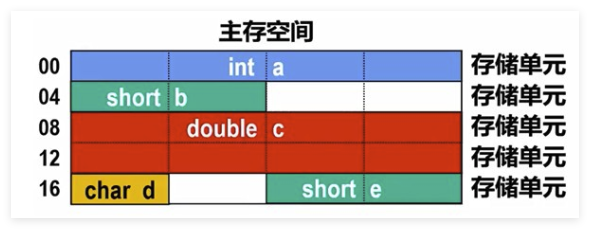
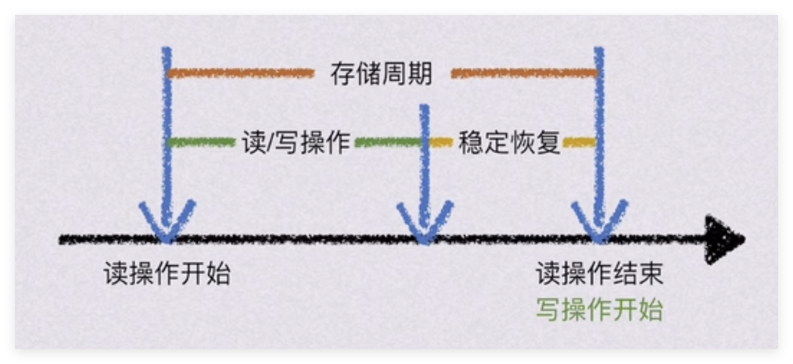

# 计算机存储器

## 概述

### 存储器分类

存储器可以按照多种分类方式进行分类：

#### 按可改写性分类

- 只读存储器（ROM）：只能读取，不能修改
- 读写存储器（RAM）：可以读取和修改

#### 按可保存性分类

- 易失性存储器：断电后数据丢失，如 RAM
- 非易失性存储器：断电后数据仍然存在，如 ROM、硬盘、闪存

#### 按功能和存取速度分类

就是存储器的层次结构。由上至下，速度逐渐降低，容量逐渐增加：

- 寄存器（D触发器）
- 缓存 / 高速缓冲存储器 / Cache（SRAM）
- 主存储器 / 内存 （DRAM）
- 辅助存储器 / 外存

#### 按存取方式分类

- 顺序存储器：存取时间和物理位置密切相关，如磁带
- 随机存储器：存取时间与物理位置无关，如寄存器
- 直接存储器：上述两者的结合，先随机访问区块开头再顺序访问区块内，如硬盘
- 内容可寻址存储器 / 相联存储器：通过内容而非地址进行访问，如 CAM

#### 按存储介质分类 

- 磁存储器：如硬盘、磁带
- 光存储器：如 CD、DVD
- 半导体存储器：如 RAM、ROM

其中半导体存储器又如下分类：

- 随机存储器（RAM）
  - 静态随机存储器（SRAM）
  - 动态随机存储器（DRAM）
    - 同步动态随机存储器（SDRAM）
- 只读存储器（ROM）
  - 可编程只读存储器（PROM）
  - 可擦除可编程只读存储器（EPROM）
  - 电可擦除可编程只读存储器（EEPROM）
    - 闪存（Flash Memory）

### 存储器性能指标

$B_m$ 代表带宽，$t_m$ 代表存取周期，$n$ 代表每次存取字节数，则

$$
B_m = \frac{n}{t_m}
$$

## 内存

### 内存寄存器

内存和 CPU 之间有两个寄存器

- 内存地址寄存器（MAR）：存储要访问的内存地址，A 指 Address
- 内存数据寄存器（MDR）：存储从内存读取的数据或要写入内存的数据，D 指 Data

当 CPU 要读写内存时，会经历如下步骤：

1. 地址定位： CPU 将目标内存地址写入 MAR
1. 地址发送： 地址通过地址总线传送到存储器
1. 控制信号： CPU 发出“读”或“写”命令信号
1. 数据传输： 存储器找到对应单元，将数据通过数据总线送入 MDR
1. 完成读取： CPU 从 MDR 中取走数据，存入内部的通用寄存器

### 存储方式

#### 字长 vs 存储字长

**字长**通常指机器字长 / 数据字长，是指 CPU 每次处理的数据位数，现代计算机通常是 32 位或 64 位，同时它也规定了主存地址的最大长度

此外还有**存储字长**，指内存中每个存储单元以及 MDR 的位数，现代计算机通常是 8 位（1 字节）

#### 按字节编址 vs 按字编址

- 按字节编址：按 Byte 编址
- 按字编址：按字长（机器字长）编址

#### 大小端

- 大端模式（Big Endian）：高位字节存储在低地址，低位字节存储在高地址，常见于网络协议和某些 RISC 处理器（如 PowerPC）
- 小端模式（Little Endian）：低位字节存储在低地址，高位字节存储在高地址，常见于大部分现代处理器（如 x86 和 ARM） 

例如存放 0x12345678 的 4 字节数据：

| 地址 | 0x00 | 0x01 | 0x02 | 0x03 |
| --- | --- | --- | --- | --- |
| 大端 | 0x12 | 0x34 | 0x56 | 0x78 |
| 小端 | 0x78 | 0x56 | 0x34 | 0x12 |

#### 对齐

类似 C 语言中的结构体对齐，内存中的数据也需要按照一定的规则进行对齐，以提高访问效率。通常情况下，数据的起始地址应该存储字长的整数倍。例如：

#### 存储周期

