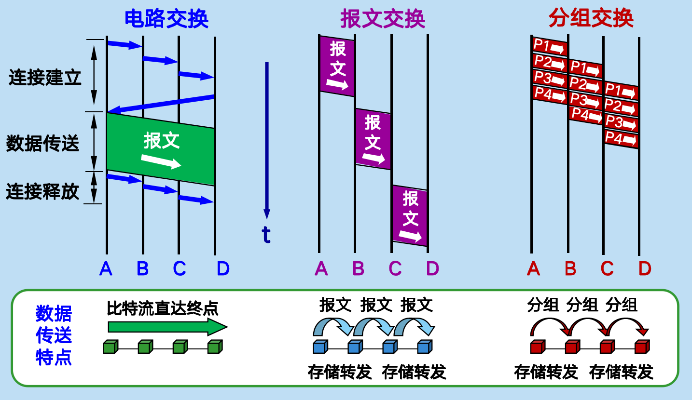
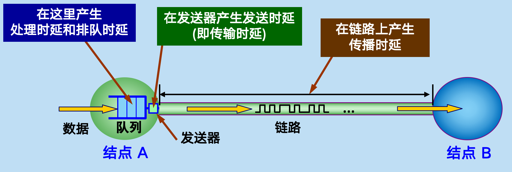

# 计算机网络概述

## 一些概念

### 网络的概念

- 计算机网络：由节点 Node 和链路 Link 组成，Node 包括计算机、路由器和交换机等
- internet：互连网，用交换机连接多个网络而成
- Internet：互联网，即因特网，必须使用 TCP/IP 协议族
- ISP：互联网服务提供商，类似供水和电力公司

三级 ISP

- Tier 1：连接全球/洲际，如中国电信、AT&T
- Tier 2：连接国家/区域，如CERNET、电信省级分公司
- Tier 3：连接城市/社区，如校园网、小型宽带服务商

> Tier 2 的核心意义在于本地消化，让大量用户从内容分发网络 CDN 中获取资源而不必占用 Tier 1 的骨干网

### 交换方式

#### 电路交换

最古老的方式，源于早期的电话系统，通信前建立物理专线，结束后需要释放连接

- 特点：面向连接、固定传输带宽、不适合传输计算机数据
- 优点：通信延迟小、有序传输、没有冲突、实时性强
- 缺点：建立连接时间长、灵活性差、难以实现差错控制

#### 报文交换

将数据和附加信息打包成报文 Message 发送

#### 分组交换

将报文拆成若干等长数据段并附加首部形成分组 Packet 发送

### 计算机网络的功能

- 数据通信、资源共享、分布式处理、提高可靠性、负载均衡

### 计算机网络的组成

- 从组成部分看：硬件、软件、协议
- 从工作方式看：边缘（如主机和服务器）、核心（如路由器和通信链路）
- 从功能组成看：通信子网和资源子网

### 计算机网络的分类

- 按照分布范围：广域网 WAN、城域网 MAN、局域网 LAN、个人网 PAN（如手机、电脑、蓝牙键盘构成的网络）
- 按照传输技术：广播式网络、点对点网络
- 按照拓扑结构：总线、星形、环形、网状
- 按照使用者：公用网、专用网
- 按照传输介质：有线网络、无线网络

### 计算机网络的性能指标

- 速率
- 带宽
- 吞吐量
- **时延**
- 时延带宽积
- 往返时延 Round Turn Time, RTT
- 信道利用率

> 描述数据量时通常用 K、M、G，表示 2 的幂次，且用 B / Byte 为单位；描述速率通常用 **k**、M、G，表示 10 的幂次，且用 b / bit 为单位

此外还有非性能指标：费用、质量、标准化、可靠性、可扩展性和可升级性、易于管理与维护

### 时延详解

网络时延的组成：
$$
\begin{align}
总时延 &= 处理时延 + 排队时延 + 发送时延 + 传播时延 \\
&= 处理时延 + 排队时延 + \frac{分组长度}{发送速率} + \frac{信道长度}{信道电磁波传播速率}
\end{align}
$$

常见信道电磁波传播速率：

- 自由空间： $3 \times 10^8 ~\text{m/s}$ 接近光速
- 铜电缆：$2.3 \times 10^8 ~\text{m/s}$
- 光纤：$2 \times 10^8 ~\text{m/s}$

## 计算机网络体系结构

**体系结构就是协议+层次**。网络需要分层，核心目的是**解耦**，好的分层之间耦合性低，效率更高。

### 协议、接口、服务

- 协议：对等实体之间通信的规则集合，由语法、语义、时序组成
- 接口：同一系统中相邻两层实体之间进行交互的逻辑接口被称为 **服务访问点 SAP**，是某层提供给上层的入口
- 服务：某一层向其上一层提供的功能集合

服务可分为

- 面向连接服务 和 无连接服务
- 可靠服务 和 不可靠服务
- 有应答服务 和 无应答服务

协议和服务的关系还有：

- 协议是水平的，服务是垂直的
- 协议双方平等，服务双方分为服务方和被服务方
- 协议虚拟，服务实在
- 协议是约定，服务是落实，协议以来服务存在
- 协议的实现为上层提供服务

TCP/IP 协议族 Internet protocol suite 就是当今最常用的体系结构，包括了层次定义和各种协议，呈沙漏状。它的核心设计理念如下：

- Everything over IP：各种上层应用协议和服务都可以通过 IP 协议传输
- IP over Everything：IP 协议可以在几乎任何类型的底层物理网络技术上运行

### 层次模型

|层次|ISO/OSI|TCP/IP|典型标准/协议|
|---|---|---|---|
|第7层|应用层|应用层|HTTP/HTTPS DNS FTP IMAP DHCP SSH|
|第6层|表示层|*同上|HTTP FTP TLS/SSL 有此层功能|
|第5层|会话层|*同上|HTTP RPC 有此层功能|
|第4层|传输层|传输层|TCP UPD TLS/SSL|
|第3层|网络层|网际层|IP ICMP|
|第2层|数据链路层|网络接口层|IEEE802 Wi-Fi Ethernet MAC PPPoE|
|第1层|物理层|*同上|Ethernet 猫|

> 只有上三层属于 TCP/IP 协议簇，网络接口层实际上是空的，随着网络发展下两层逐渐标准化，所以现实中常用 1 2 3 4 7 五层协议

各层功能如下：

#### 应用层 Application

应用进程和网络的接口，协议多且复杂

#### 表示层 Presentation

解决异构系统间信息表示不一致的问题。功能包括数据格式转换、数据压缩、加密解密

#### 会话层 Session

管理进程间的会话。功能包括建立、维护和中止会话连接

#### 运输层 Transport

负责端到端通信（端口号）

功能：有提供**复用分用**、差错控制、流量控制、连接管理、可靠传输管理等服务

> 复用是指多个进程使用一个传输层服务，分用是指正确分发传输层数据给多个进程

#### 网络层 Network

负责主机到主机通信（IP 地址）、传输数据报 / 分组

功能：**路由选择、拥塞控制、网际互联**、差错控制、流量控制、连接管理、可靠传输管理

#### 数据链路层 Data Link

负责节点到节点通信（MAC 地址）、传输帧 Frame

功能：差错控制和流量控制

> 差错控制就是信号出错时进行重传或矫正；流量控制就是协调发送和接收方的速率，防止发送速率太快接收丢帧

#### 物理层 Physical

负责传输比特、定义接口参数、信号含义和电气特征

> 光纤、同轴电缆、双绞线、无线信道等物理介质被称为物理层之下的第 0 层

## 例题

【1】试在下列条件下比较电路交换和分组交换。要传送的报文共 $x$ bit。从源点到终点共经过 $k$ 段链路，每段链路的传播时延 $d$ s，数据率为 $b$ bit/s。在电路交换时电路的建立时间为$s$ s。在分组交换时，分组长度为 $p$ bit，每个分组所必须添加的首部都很短，对分组的发送时延的影响在本题中可以不考虑。此外，各节点的排队等待时间也忽略不计。问在怎样的条件下，分组交换的时延比电路交换的要小？

电路交换总时延：
$$
T_1 = s + \frac x b + kd
$$
分组交换总时延：
$$
T_2 = \frac x b + (k - 1) \frac p b + kd
$$
由上得，当：
$$
(k - 1) \frac p b < s
$$
分组交换时延比电路交换要小

【2】在上题的分组交换网中，设报文长度和分组长度分别为 $x$ 和 $p+h$ bit，其中 $p$ 为分组的数据部分的长度，而 $h$ 为每个分组所添加的首部长度，与 $p$ 的大小无关。通信的两端共经过 $k$ 段链路。链路的数据率为 $b$ bit/s，但传播时延和节点的排队时间均可忽略不计。若打算使总的时延为最小，问分组的数据部分长度 $p$ 应取为多大？

分组个数为 $n = x/p$，总传输长度为 $n(p+h)$，总时延为：
$$
\begin{align*}
T_2' &= \frac{n(p+h)}{b}+(k-1)\frac{p+h}{b}+kd \\
&= \frac{(k-1)p+xh/p+x+hk-h}{b} + kd \\
\end{align*}
$$

要使 $T_2'$ 最小即使 $(k-1)p+xh/p$ 最小，对 $p$ 求导得当
$$
p = \sqrt{\frac{xh}{k-1}}
$$
时 $T_2'$ 变化率为 0，此时时延取到最小值
