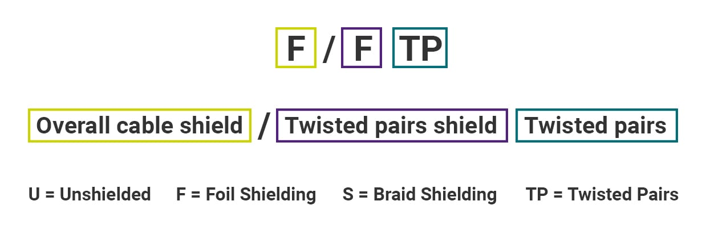

# 计算机网络：物理层

本章包括物理层及物理层之下的内容，作为通信工程和计算机网络之间的桥梁

## 基本概念

物理层的作用特点包括：确定传输媒体的接口特性，包括机械特性（接口形状）、电气特性（电压范围）、功能特性（电平意义）和过程特性（事件出现顺序）

## 数据通信

一些通信的基本概念：

- 消息 Message：是通信的目的，指的是信息的表现形式，如话音、文字、图像、视频等
- 数据 Data：是运送消息的实体，通常是有意义的符号序列
- 信号 Signal：是数据的电气或电磁表现，可分为模拟信号（连续）和数字信号（离散）
- 码元 Symbol：在使用时间域波形表示数字信号时，代表不同离散数值的基本波形称为码元，本质就是通信时信号的最小单位时间片段，一个码元可以代表多个 bit

### 关于信道

信道 Channel 是指向某一个方向传送信息的媒体，一条通信电路通常包含发送和接收两个信道，存在三种通信方式：

- 单向通信（单工）：只能有一个方向的通信，没有反方向的交互，例如无线电广播
- 双向交替通信（半双工）：通信双方都可以发送信息，但不能同时发送，需要一方发送、另一方接收，随后再反过来
- 双向同时通信（全双工）：通信双方可以同时发送和接收信息，传输效率最高

### 信道的极限容量

信道的极限容量主要讨论在物理限制下，一个信道最高能跑多快。核心内容可以概括为以下两点：

- **奈氏准则 Nyquist**：在假定的理想条件下（无噪声），为了避免**码间串扰**，码元的传输速率是有上限的。在带宽为 $W$ (Hz) 的低通信道中，最高码元传输速率是 $2W$ (码元/秒)。
- **香农公式 Shannon**：在有随机热噪声的实际信道中，极限信息传输速率 $C$ 由带宽和**信噪比**决定，公式为：$C = W \log_2(1 + S/N)$ (bit/s)。这表明信道的带宽越宽或信噪比越大，极限传输速率就越高。

奈氏准则限制了码元速率，香农公式限制了比特速率。

虽然编码技术让一个码元携带更多比特来提高速率，但香农公式给出了物理极限，任何实际传输速率都不可能超过它

## 编码与调制

调制是物理层为了让信号适应信道传输特性而进行的处理。根据处理方式的不同可分为：

- **基带调制 Baseband Modulation**，将原始数字信号（01比特）变换成数字基带信号（特定波形电信号），这一步就是网卡 NIC 的工作
- **带通调制 Passband Modulation**，将基带信号（通常是数字基带信号）变换成模拟信号（频带信号/带通信号），这一步就是调制解调器 Modem 的工作

> 在现实的计算机网络（如以太网）中，基带调制通常被称为信道编码 Channel Encoding 或者编码，而调制 Modulation 是指带通调制

### 编码方式

为了解决时钟同步、直流分量和检错三个问题，调制前需要对信号编码，常见的基带编码方式如下，通常由网卡实现

- **不归零编码 NRZ, Non-Return-to-Zero**，最原始的编码，高电平为 1，低电平为 0。无法区分“全 0”和“断线”，且存在严重的同步问题
- **曼彻斯特编码 Manchester Encoding**，用电压跳变（高向低、低向高）表示比特，相比前者自带时钟同步，传统的 10 Mbps 以太网使用这种
- **差分曼彻斯特编码 Differential Manchester**，原理：中间必须跳变（用于同步），但起始位是否跳变决定了是 0 还是 1。优点：抗干扰能力比普通曼彻斯特更强。令牌环网使用这种
- **分块编码编码 nB/mB**，一种“映射”编码。包括 64B/66B、8B/10B 等多种标准，最常用的编码方式

### 调制方式

常见的带通调制方式如下，通常由光猫、Wi-Fi 芯片或手机基带芯片实现

- **ASK 幅移键**控通过振幅的变化表示 0 和 1（有波是 1，没波是 0）
- **FSK 频移键**控通过频率的变化表示 0 和 1（快波是 1，慢波是 0）
- **PSK 相移键**控通过波形的初始相位来表示 0 和 1
- **QAM 正交幅度调制**。同时改变振幅和相位，一个波形能携带好几个比特

> 实际上，前三种调制方式就是 $A\sin (\omega t + \phi)$ 的三个参数，QAM 通过两个参数构建向量，每一个向量指向代表一种 bit

总结：数据 (0/1) 
$\rightarrow$ [编码] $\rightarrow$ 基带信号 (电脉冲) $\rightarrow$ [调制] $\rightarrow$ 带通信号 (高频波)

## 传输媒体

- 导引型
  - 双绞线
    - 无屏蔽双绞线 UTP
    - 屏蔽双绞线 STP
  - 同轴电缆
  - 光缆
    - 多模光纤
    - 单模光纤
- 非导引型
  - 无线电微波通信
  - 卫星通信
    - 同步卫星 GEO
    - 低轨卫星 LEO
  - 红外与激光

### 双绞线

为什么要双绞？利用“对称性”抵消外部干扰和内部串扰

为什么要屏蔽？利用法拉第笼效应屏蔽外界电磁波并防止信号外泄，屏蔽层必须接地

STP 线又分为 X/XTP 不同的标准，其中 F 代表铝箔屏蔽，S 代表编制屏蔽

- 外层铝箔屏蔽 F/UTP
- 内层铝箔屏蔽 U/FTP
- 双层铝箔屏蔽 F/FTP

双绞线国际常用标准是 [EIA/TIA-568](https://en.wikipedia.org/wiki/ANSI/TIA-568) 其中关于平衡双绞线的 TIA-568.2，常用接头为 [8P8C，或称为RJ45](https://zh.wikipedia.org/wiki/8P8C)，此外双绞线有多种规格，参见 [Twisted pair](https://en.wikipedia.org/wiki/Twisted_pair)

### 光纤和光缆

多模光纤：利用光的全反射原理，适合近距离传输

单模光纤：纤芯极细，直径接近波长，光一直向前传播。性能更好，适合长途传输

光缆：由多根光纤、填充物、加强芯和电源线组成的介质

> 光缆中电源线是为了给中继器供电，将光信号转为电信号再转回光信号弥补传输损失

### 无线传输

**多径效应**是指在无线通信中，基站发出的信号由于受到障碍物（如建筑物、山体）的反射，通过多条不同的路径到达接收端（如手机）的现象，其主要影响如下：

- 信号叠加与失真：多条路径的信号在接收端叠加，通常会导致信号产生很大的失真
- 多径衰落：这种信号的相互干扰也会引起衰落现象

同步卫星停留在地球上方 36,000km，低轨卫星，如“星链”计划，时延更低

## 信道复用与接入技术

复用 multiplexing，允许用户使用一个共享信道进行通信，分为

| 技术 | 区分维度 | 资源分配方式 | 典型应用 |
| --- | --- | --- | --- |
| 频分复用 FDM | 频率 | 划分不同频带，用户独占频率 | 广播、电视 |
| 时分复用 TDM | 时间 | 划分固定时隙，用户独占时隙 | 电话交换网 |
| 统计时分复用 STDM | 需求 | 动态分配时隙，按需分配 | 计算机网络数据传输 |
| 波分复用 WDM | 波长 | 光频段的频分复用 | 长途光纤通信 |
| 码分复用 CDM | 码型 | 靠数学上的正交编码区分 | 移动通信 (CDMA) |

### 统计时分复用 STDM

在传统的同步时分复用 TDM 中，时间被分成固定的“时隙”，每个用户分到一个，如果只有少量用户在使用信道，就会造成极大浪费

STDM 不再固定分配时隙，而是“按需分配”。有数据，谁就占用信道发送。所有用户的数据先进入一个集中器（Concentrator）的缓存队列中，然后集中器按顺序把这些数据填入时隙里。

由于

### 码分复用 CDM

码分复用的数学基础是，每个站有一个 m bit 的码片 chip，所有码片是相互正交的

> 将码片 0 看作 -1，1 看做 +1，就能转化为向量。**正交**是指内积（对应位置的数相乘，然后全部加起来）为 0，**规格化**是指算完内积后除以向量维数，即码片 bit 数 m

当站需要发送 1 时发送自己的码片，需要发送 0 时发送自己码片的反码，信道上的叠加信号就是各站发送的向量的线性叠加。接收时将信号和某站码片进行规格化内积运算，若为 1 则该站发送 0，若为 -1 则该站发送 1，若为 0 则该站没有发送比特

举个例子：

- 有 A 站码片为 1111 即 $S = (+1, +1, +1, +1)$，B 站码片为 1010 即 $T = (+1, -1, +1, -1)$，他们的内积为: $S \times T = 1 - 1 + 1 - 1 = 0$
- 当 A 发送 1，B 发送 0，即二者发送 $(+1, +1, +1, +1)$ 和 $(-1, +1, -1, +1)$，线性叠加后得到 $X = (0, +2, 0, +2)$
- 规格化内积：$S' = (X \times S) / 4 = 1$ 接收到 A 站发送的 1，$T' = (X \times T) / 4 = -1$ 接收到 B 站发送的 0
