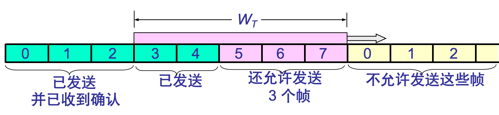
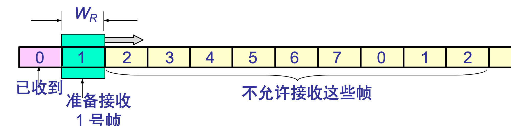
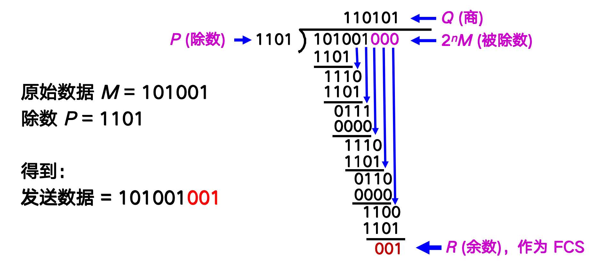
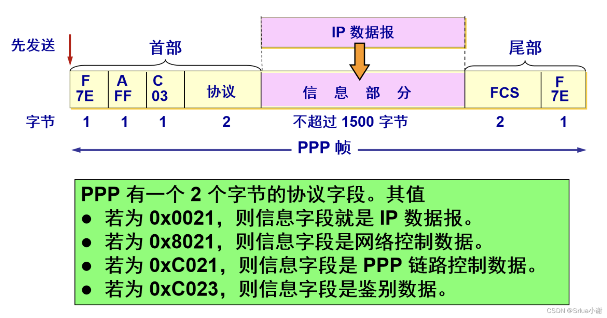
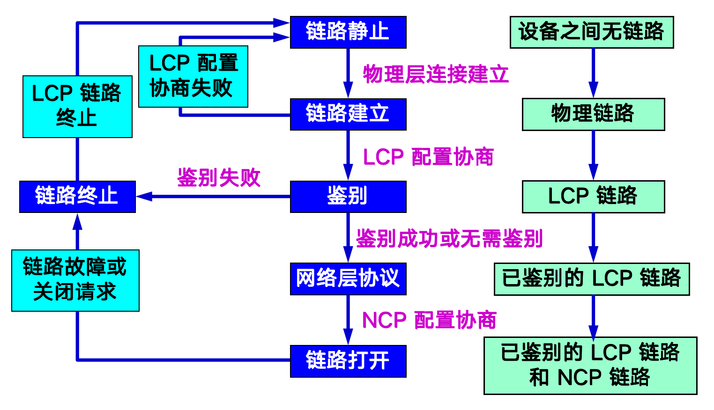
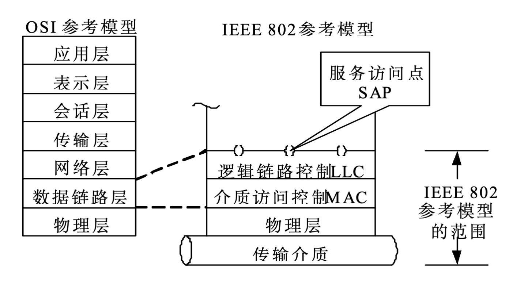

# 数据链路层

## 基本概念

数据链路层有如下概念：

- 结点 Node：网络中的设备，如计算机、路由器等
- 链路 Link：连接两个结点的物理介质，如电缆、光纤等（即物理链路）
- 数据链路 Data Link：将协议加载到物理链路上，提供可靠的数据传输服务（即逻辑链路）
- 通路 Path：连接两个结点的所有链路的集合

> 链路和数据链路可类比公路和道路标线，前者承载汽车行驶，后者指导汽车行驶，两者共同实现交通运输

- 帧 Frame：数据链路层传输的数据单元，包含数据和控制信息

> 不同网络层级的数据包的名字：数据链路层：帧 Frame；网络层：数据包 Packet；传输层：段 Segment；应用层：消息 Message

## 数据链路层的功能

### 为网络层提供服务

将网络层的数据包封装成帧，并提供可靠的数据传输服务，分为如下三种：

- 无确认无连接服务，如以太网，速度快，开销小，可靠性低但可由上层保证
- 有确认无连接服务，如Wi-Fi，速度较快，开销适中，可靠性较高
- 有确认有连接服务，如PPP，开销大，可靠性高

> 确认：发送方发送数据后，接收方回复一个ACK确认消息，表示数据已成功接收；连接：发送方和接收方在数据传输前建立一个逻辑连接

选择合适数据链路层服务类型既要看下层物理介质的质量，也要看上层应用对实时性和可靠性的要求

无确认无连接服务适用于以下情况：

- 高质量的物理介质
- 实时性要求极高

有确认无连接服务适用于以下情况：

- 不可靠的物理环境

有确认有连接服务适用于以下情况：

- 极其糟糕的传输环境

现代网络中在数据链路层，有确认有连接服务已经很少见了，连接的功能正在逐步上移，由传输层（TCP）甚至应用层（QUIC）来实现

### 链路管理

又称链路控制，负责建立、维护和终止数据链路连接，确保数据链路的正常运行

### 帧界定、帧同步和透明传输

- 帧界定：确定帧的开始和结束位置，常用方法有定长帧、特殊字符分隔帧和比特填充帧
- 帧同步：确保发送方和接收方对帧的界定保持一致，常用方法有时钟同步和帧头同步
- 透明传输：确保数据中的特殊字符不会被误认为帧界定符，常用方法有比特填充和字节填充

### 流量控制和差错控制

- 流量控制：调节数据传输速率，防止发送方过快导致接收方处理不过来，常用方法有滑动窗口协议和令牌桶算法
- 差错控制：检测和纠正数据传输中的错误，常用方法有循环冗余校验 (CRC) 和前向纠错 (FEC)

## 可靠传输

可靠传输是指在不可靠传输信道上实现无差错传输。可靠传输的实现机制是帧编号、ACK、超时重传

不可靠传输和可靠传输同样要校验，同样要实现无差错接受，但不可靠传输无连接、无序、无确认、无重传

完全理想化传输中，链路传输时不出差错也不会丢包，且无论发送速率，接收方都能及时处理。这两点在现实中都不成立，但这是我们的目标，因此需要设计协议来解决这些问题

### 停止等待协议

这个协议的设计思路经过了以下几个阶段：

- 为了解决流量控制问题，让发送方每发送一个帧后就等待接收方的确认 (ACK)，收到 ACK 后才发送下一个帧
- 为了解决数据出错的问题，要将数据加入校验码，如果校验失败丢弃帧
- 为了解决 ACK 丢失而发送方一直等待造成系统死锁，需要设置一个定时器，如果超时则重传
- 为了解决 ACK 丢失而接收方接收到重复帧，需要在帧中加入序列号（1 bit 即可）以区分不同的帧

完整的发送方逻辑：

- 从上层接收数据，封装成帧，送交发送缓存
- 发送帧并启动定时器
- 等待 ACK 或定时器超时
  - 如果收到正确的 ACK，停止定时器，清空缓冲区，准备发送下一个帧
  - 如果定时器超时，重传当前帧并重新启动定时器

> 发送的帧编号为 0，则正确接收 ACK 编号为 1，反之亦然

完整的接收方逻辑：

- 等待帧到达
- 接收帧并放入接收缓冲区
- 检查帧是否正确（如 CRC 校验）
  - 如果帧正确，发送 ACK 并将数据交给上层
  - 如果帧错误，丢弃帧并不发送 ACK

> 接收 vs 接受：接收是被动获取数据，接受是主动同意接收数据，代表接收了合法的数据

### ARQ 协议

停止等待协议的效率较低，因为发送方每发送一个帧就要等待 ACK，导致链路利用率不高。连续 ARQ 协议在停止等待协议的基础上，通过允许发送方在等待 ACK 的同时继续发送多个帧来提高效率

双方维护一个滑动窗口，表示当前可以发送或接受的帧的范围，分别称为发送窗口和接收窗口

发送窗口

接收窗口

编号的 bit 位决定了窗口的大小，若编号为 $n$ bit，则窗口大小最大为 $2^n - 1$

为了实现同时发送和接收多个帧，ARQ 协议需要使用更大的发送和接收缓存、多个计时器以及更多 bit 的帧编号来区分不同的帧

连续ARQ协议是一种接收窗口为1的特殊化选择重传 ARQ 协议，选择重传 ARQ 协议加大接收窗口，先收下发送序号不连续但处在接收窗口中的数据帧。等到所缺序号的数据帧收齐后再一并送交主机

### 封装成帧

也称组帧，指将网络层的数据包封装成数据链路层的帧进行传输。帧有多种标准，但都大致遵循如下结构：

$$
[ 帧开始符 + 其他字段 ]_{帧首部} + 数据 + [ 校验等 + 帧结束符 ]_{帧尾部}
$$

帧的开头和结尾需要帧界定符来标识帧的边界，比如用 SOH 和 EOT 来标识帧的开始和结束，帧首部包含控制信息，如地址、类型、长度等，帧尾部包含校验码等信息用于差错控制

其中数据部分的最长长度称为最大传输单元 MTU，不同的网络类型有不同的 MTU，如以太网的 MTU 为 1500 字节

### 透明传输

为了防止帧中间的数据被误认为帧界定符，需要采用透明传输技术，比如如下两种

- 字节填充：如果数据中出现了 SOH 或 EOT，发送方会在它们前面插入一个转义字符 ESC
- 比特填充：协议规定用 01111110（连续 6 个 1）作为帧的边界。如果数据中出现了连续的 5 个 1，发送方会在它们后面插入一个 0，在帧开始后，接收方如果收到 5 个连续的 1，就会检查下一个比特，如果是 0 就丢弃这个比特，如果是 1 就认为这是帧的结束

透明传输的本质是：链路层通过某种机制，"屏蔽"了数据内容对物理传输过程的影响

### 差错控制 (CRC 为例)

CRC 运算中，本质就是将数据看成二进制数，发送方和接收方会事先约定一个生成多项式（Generator Polynomial），就是一个除数 $P(x)$，生成多项式阶数 $n$ 就是 $P(x)$ 的位数减去 1

CRC 计算和校验过程如下：

- 加零： 发送方在原始数据 $M$ 后面加上 $n$ 个 0
- 模 2 除法： 除以 $P(x)$，求得余数。
- 拼接： 把这个余数（即 CRC 校验码）替换掉刚才加的那些 0，拼接在原始数据后面发出去。
- 接收方校验： 接收方收到数据后，同样进行模2除法
  - 余数为 0：传输正确，接收。
  - 余数不为 0：传输有误，丢弃。

除法的计算过程：

如果首位为 1，则填上 $P(x)$，否则填上 0，然后按位异或，最后补齐作为下一轮的被除数，直到被除数的位数小于 $P(x)$ 的位数为止，此时的余数就是 CRC 校验码

> CRC 校验码是 FCS（Frame Check Sequence）的一种实现方式，FCS 还可以使用其他算法

## PPP 协议

PPP 协议有以下几个重要部分

- 帧格式
- 透明传输算法
- 链路控制协议 LCP
- 网络控制协议 NCP

LCP 用于建立、配置和测试数据链路连接，主要功能包括链路建立、链路配置、链路维护和链路终止；NCP 用于协商和配置网络层协议，主要功能包括协议协商、地址分配和网络层配置

### PPP 帧格式

其中

- F 代表 Flag，即帧界定符，标识帧的开始和结束
- A 代表 Address，即地址字段，通常设置为 0xFF，表示广播地址
- C 代表 Control，即控制字段，通常设置为 0x03，表示无序传输

### PPP 透明传输

- 当 PPP 用在异步传输时，使用字节填充法
- 当 PPP 用在同步传输链路时，采用零比特填充法

### PPP LCP / NCP

PPP 协议的状态机如下图所示：

## Ethernet 协议

以太网协议指 DIX Ethernet V2 或 IEEE 802.3 协议，主要用于局域网中，提供无确认无连接服务

在 IEEE 802 协议中，数据链路层被划分为两个子层：逻辑链路控制 LLC 和媒体访问控制 MAC，前者负责提供可靠传输，后者负责控制对物理介质的访问

