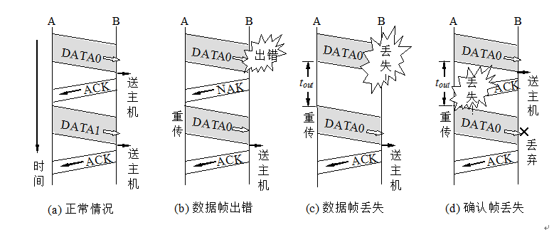
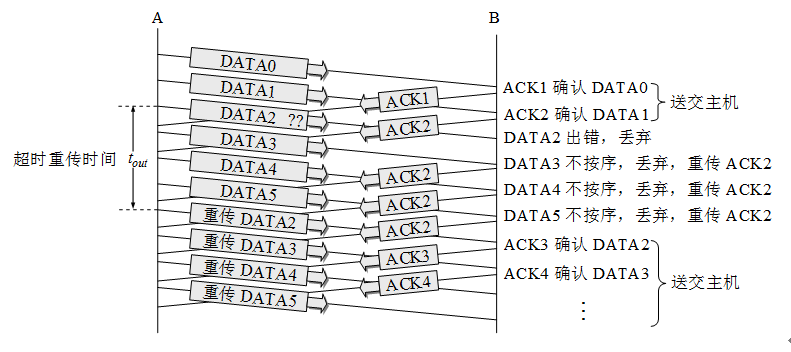

# 数据链路层

## 基本概念

数据链路层有如下概念：

- 结点 Node：网络中的设备，如计算机、路由器等
- 链路 Link：连接两个结点的物理介质，如电缆、光纤等（即物理链路）
- 数据链路 Data Link：将协议加载到物理链路上，提供可靠的数据传输服务（即逻辑链路）
- 通路 Path：连接两个结点的所有链路的集合

> 链路和数据链路可类比公路和道路标线，前者承载汽车行驶，后者指导汽车行驶，两者共同实现交通运输

- 帧 Frame：数据链路层传输的数据单元，包含数据和控制信息

> 不同网络层级的数据包的名字：数据链路层：帧 Frame；网络层：数据包 Packet；传输层：段 Segment；应用层：消息 Message

## 数据链路层的功能

### 为网络层提供服务

将网络层的数据包封装成帧，并提供可靠的数据传输服务，分为如下三种：

- 无确认无连接服务，如以太网，速度快，开销小，可靠性低但可由上层保证
- 有确认无连接服务，如Wi-Fi，速度较快，开销适中，可靠性较高
- 有确认有连接服务，如PPP，开销大，可靠性高

> 确认：发送方发送数据后，接收方回复一个ACK确认消息，表示数据已成功接收；连接：发送方和接收方在数据传输前建立一个逻辑连接

选择合适数据链路层服务类型既要看下层物理介质的质量，也要看上层应用对实时性和可靠性的要求

无确认无连接服务适用于以下情况：

- 高质量的物理介质： 比如现在的以太网 (Ethernet)。因为现在的光纤/网线质量极高，出错率极低，没必要在链路层浪费时间去确认，把错误留给上层（传输层 TCP）处理

- 实时性要求极高： 比如语音通话、视频会议。丢一两个帧没关系，要是为了重传导致画面卡顿反而更糟

有确认无连接服务适用于以下情况：

- 不可靠的物理环境：典型代表是 Wi-Fi (802.11)。无线信号非常容易受干扰，丢包率高。在链路层及时确认并重传，比等数据传到顶层再重传要高效得多

有确认有连接服务适用于以下情况：

- 极其糟糕的传输环境：比如 PPP (Point-to-Point Protocol)。PPP 主要用于拨号连接，电话线质量差，丢包率高，需要在链路层建立连接并确认每个帧的接收情况

现代网络中在数据链路层，有确认有连接服务已经很少见了，连接的功能正在逐步上移，由传输层（TCP）甚至应用层（QUIC）来实现

### 链路管理

又称链路控制，负责建立、维护和终止数据链路连接，确保数据链路的正常运行

### 帧界定、帧同步和透明传输

- 帧界定：确定帧的开始和结束位置，常用方法有定长帧、特殊字符分隔帧和比特填充帧
- 帧同步：确保发送方和接收方对帧的界定保持一致，常用方法有时钟同步和帧头同步
- 透明传输：确保数据中的特殊字符不会被误认为帧界定符，常用方法有比特填充和字节填充

### 流量控制和差错控制

- 流量控制：调节数据传输速率，防止发送方过快导致接收方处理不过来，常用方法有滑动窗口协议和令牌桶算法
- 差错控制：检测和纠正数据传输中的错误，常用方法有循环冗余校验 (CRC) 和前向纠错 (FEC)

## 通信协议

完全理想化传输中，链路传输时不出差错也不会丢包，且无论发送速率，接收方都能及时处理。这两点在现实中都不成立，但这是我们的目标，因此需要设计协议来解决这些问题

### 停止等待协议

这个协议的设计思路经过了以下几个阶段：

- 为了解决流量控制问题，让发送方每发送一个帧后就等待接收方的确认 (ACK)，收到 ACK 后才发送下一个帧
- 为了解决数据出错的问题，要将数据加入校验码，如果校验失败丢弃帧
- 为了解决 ACK 丢失而发送方一直等待造成系统死锁，需要设置一个定时器，如果超时则重传
- 为了解决 ACK 丢失而接收方接收到重复帧，需要在帧中加入序列号（1 bit 即可）以区分不同的帧

完整的发送方逻辑：

- 从上层接收数据，封装成帧，送交发送缓存
- 发送帧并启动定时器
- 等待 ACK 或定时器超时
  - 如果收到正确的 ACK，停止定时器，清空缓冲区，准备发送下一个帧
  - 如果定时器超时，重传当前帧并重新启动定时器

> 发送的帧编号为 0，则正确接收 ACK 编号为 1，反之亦然

完整的接收方逻辑：

- 等待帧到达
- 接收帧并放入接收缓冲区
- 检查帧是否正确（如 CRC 校验）
  - 如果帧正确，发送 ACK 并将数据交给上层
  - 如果帧错误，丢弃帧并不发送 ACK

> 接收 vs 接受：接收是被动获取数据，接受是主动同意接收数据，代表接收了合法的数据

总结

- 可靠传输是指在不可靠传输信道上实现无差错传输
- 可靠传输的实现机制是帧编号、ACK、超时重传

### 连续 ARQ 协议

停止等待协议的效率较低，因为发送方每发送一个帧就要等待 ACK，导致链路利用率不高。连续 ARQ 协议在停止等待协议的基础上，通过允许发送方在等待 ACK 的同时继续发送多个帧来提高效率

双方维护一个滑动窗口，表示当前可以发送或接受的帧的范围，分别称为发送窗口和接收窗口

为了实现同时发送和接收多个帧，连续 ARQ 协议需要使用更大的发送和接收缓存、多个计时器以及更多 bit 的帧编号来区分不同的帧
